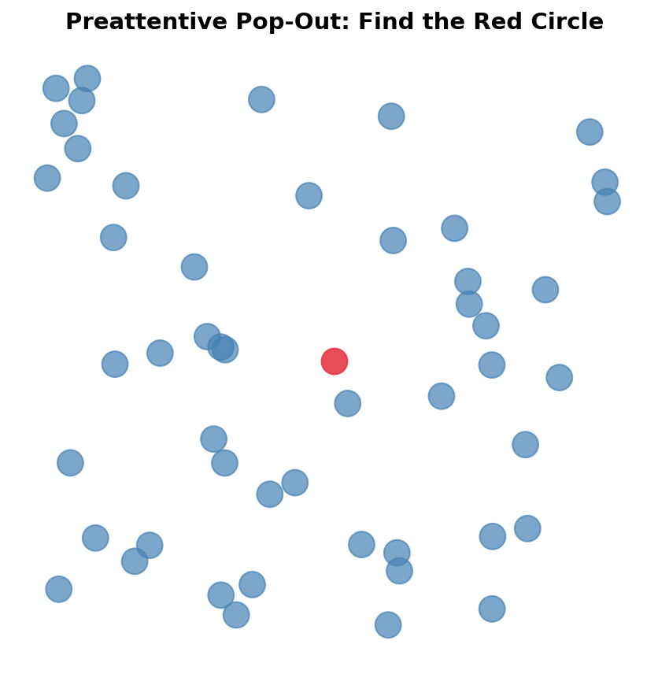

# Class 3 – Data Visualization  
## Visual Perception & Cognitive Load  
## Data Types, Encodings & Grammar of Graphics
## Python Visualization Fundamentals

---

## Slide 1 – Class Overview

**Today's Learning Objectives**
- Understand how humans perceive visual information
- Learn about cognitive load and its impact on visualization design
- Master data types and their valid visual encodings
- Explore the Grammar of Graphics framework
- Implement visualizations using Python (Matplotlib, Seaborn)
- Apply perceptual principles to create effective visualizations

**Course Context**: Building on Week 2's Python introduction

---

## Slide 2 – Why Visualization Matters in Data Science

**Visualization is not just presentation—it's cognition**

- Data visualization is the interface between:
  - Computation (algorithms, models)
  - Human decision-making
  
- Every visualization choice affects:
  - ✅ Speed of insight
  - ✅ Accuracy of interpretation
  - ✅ Quality of decisions
  
- Poor visualization = Poor analytics outcomes


---

## Slide 3 – Visualization as a Human–AI Interface

**In modern analytics and AI systems:**

```
┌─────────────┐       ┌──────────────┐       ┌─────────────┐
│   Raw Data  │  →    │  AI Model    │  →    │Visualization│  →  Human Decision
│             │       │  (Compute)   │       │  (Interface)│
└─────────────┘       └──────────────┘       └─────────────┘
```

- Models compute predictions
- Humans make decisions
- **Visualization is the critical translation layer**
- Human perceptual limits become system constraints

**Key Insight**: If the visualization fails, the entire system fails at the decision layer.

---

## Slide 4 – The Two Pathways of Visual Processing

**Visual processing happens in two stages:**

1. **Early Vision (Preattentive Processing)**
   - Parallel processing
   - Fast (< 200-250 milliseconds)
   - Automatic, no conscious effort
   - Detects basic features

2. **Late Vision (Attentive Processing)**
   - Serial processing
   - Slow (requires focus)
   - Conscious effort required
   - Integrates meaning and relationships

**Design Principle**: Leverage preattentive processing for critical information.


---

## Slide 5 – Preattentive Processing: The 200ms Window

**Certain visual features are detected instantly**

Preattentive features enable:
- ✨ Rapid detection
- ✨ Visual pop-out effect
- ✨ Fast filtering and scanning
- ✨ Parallel comparison

**Examples of preattentive features:**
- Position
- Color (hue)
- Intensity/brightness
- Size/length
- Orientation/angle
- Shape
- Motion
- Enclosure

**Key Design Principle**: Use preattentive features for what matters most in your visualization.



---

## Slide 6 – Demonstrating Preattentive Processing

**Quick Exercise**: Find the red "O" among blue "O"s

```
O O O O O O O O O O
O O O O O O O O O O
O O O O O O O O O O
O O O O ● O O O O O  ← Found it instantly?
O O O O O O O O O O
```

**Now find the red "Q" among red "O"s and blue "Q"s**

This takes much longer! Why?
- First task: Single feature (color) - **preattentive**
- Second task: Conjunction of features (color + shape) - **requires attention**

**Design Implication**: Don't force users to search for multiple attributes simultaneously.


---

## Slide 7 – Visual Attention is Limited

**The harsh reality of human attention:**

- ❌ Humans cannot attend to everything at once
- ❌ Attention is selective and focused
- ❌ Users must actively search, filter, and compare

**Implications for dashboard design:**
- If everything is highlighted, nothing is highlighted
- Overloading visual channels creates cognitive fatigue
- Priority must be encoded visually

**Attention capacity**: ~3-4 visual objects simultaneously


---

## Slide 8 – Change Blindness

**Large changes can go unnoticed if attention is not directed**

Common in:
- 🖥️ Real-time dashboards (values update but users don't notice)
- 📊 Multi-panel layouts (change in one panel while viewing another)
- 🎬 Animated transitions (too fast or too subtle)
- 📱 Information-dense interfaces

**Design Solutions:**
- Use motion for important changes
- Add explicit alerts/notifications
- Use color + position changes together
- Minimize unnecessary animation


---

## Slide 9 – Inattentional Blindness: The Invisible Gorilla

**Famous experiment**: Watch a video of people passing basketballs
- Task: Count the passes
- Result: 50% of viewers miss a person in a gorilla suit walking through!

**Lesson for visualization:**
- Users focused on one task will miss other information
- Don't assume users will "just notice" important patterns
- **Make critical information impossible to miss**

**Design Principle**: If it's important, make it preattentive or explicitly direct attention to it.


---

## Slide 10 – Gestalt Principles: How We Group Information

**Gestalt Psychology**: The whole is greater than the sum of its parts

**Core principle**: Our brains automatically organize visual elements into groups

**Key Gestalt principles for visualization:**
1. Proximity
2. Similarity  
3. Enclosure/Common Region
4. Continuity
5. Connection
6. Closure

**Why this matters**: Perception overrides logic. Users will group elements based on visual properties, regardless of what your legend says.


---

## Slide 11 – Gestalt Principle: Proximity

**Objects close together are perceived as related**

```
A A A    B B B    C C C
A A A    B B B    C C C
A A A    B B B    C C C
```

Users will see 3 groups, not 27 individual items.

**In visualization:**
- ✅ Place related charts near each other
- ✅ Use whitespace to separate unrelated elements
- ❌ Don't rely only on color to show groups
- ❌ Accidental proximity creates false relationships

**Real-world mistake**: Dashboard elements randomly placed create confusing relationships.


---

## Slide 12 – Gestalt Principle: Similarity

**Objects that look similar are perceived as related**

Similar:
- Color
- Shape  
- Size
- Orientation
- Texture

**In visualization:**
- ✅ Use consistent encoding within a group
- ✅ Use distinct styles for different data types
- ❌ Don't reuse visual encodings inconsistently
- ❌ Don't use similar colors for unrelated data

**Example**: All sales data in blue shades, all costs in red shades.


---

## Slide 13 – Gestalt Principle: Enclosure & Common Region

**Objects within a boundary are perceived as grouped**

```
┌─────────────┐    ┌─────────────┐
│  Group A    │    │  Group B    │
│  ● ● ●      │    │  ■ ■ ■      │
│  ● ● ●      │    │  ■ ■ ■      │
└─────────────┘    └─────────────┘
```

**Power of enclosure:**
- Stronger than color alone
- Stronger than proximity
- Creates clear visual hierarchy

**In dashboards:**
- Use cards/panels for related metrics
- Use background shading for grouped sections
- Be careful with nested enclosures (can create confusion)


---

## Slide 14 – Gestalt Principle: Connection

**Physically connected elements are perceived as related**

```
A ━━━ B        C     D

E              F ━━━ G
```

We see: (A-B), C, D, E, (F-G)

**In visualization:**
- Line charts naturally show relationships
- Connected scatter plots show sequences
- Network diagrams use this principle fundamentally

**Design tip**: Connection is one of the strongest grouping cues.


---

## Slide 15 – Gestalt and Dashboard Design Mistakes

**Common failures when Gestalt principles are ignored:**

❌ **Random layout**: Elements scattered without visual hierarchy  
❌ **Inconsistent spacing**: Creates accidental groups  
❌ **Color chaos**: Similar colors used for unrelated data  
❌ **Over-boxing**: Everything has a border, nothing stands out  
❌ **No whitespace**: Cognitive overload  

✅ **Good dashboard design:**
- Clear visual hierarchy through proximity and enclosure
- Consistent use of similarity within groups
- Strategic whitespace guides attention
- Visual grouping matches logical relationships

---

## Slide 16 – Introduction to Cognitive Load Theory

**Core Concept**: Working memory has limited capacity

**Cognitive Load Theory (Sweller, 1988)**:
- Human working memory can hold ~7±2 chunks of information
- Processing capacity is limited
- Overload leads to errors and decision fatigue

**Three types of cognitive load:**
1. **Intrinsic Load** - inherent complexity of the task
2. **Extraneous Load** - unnecessary complexity from poor design
3. **Germane Load** - productive mental effort toward learning/insight

**Goal in visualization**: Minimize extraneous load, manage intrinsic load, maximize germane load.


---

## Slide 17 – Intrinsic Load: Inherent Complexity

**Intrinsic load comes from:**
- Data complexity (volume, dimensionality)
- Task complexity (comparison, correlation, prediction)
- Domain complexity (specialized knowledge required)

**You cannot eliminate intrinsic load**, but you can manage it:

✅ **Staging**: Break complex tasks into steps  
✅ **Scaffolding**: Provide context and guides  
✅ **Progressive disclosure**: Show detail on demand  
✅ **Hierarchy**: Present overview first, details later  

**Example**: 
- ❌ Showing 50 variables at once → overwhelming
- ✅ Showing top 10, with option to explore more → manageable

---

## Slide 18 – Extraneous Load: Unnecessary Complexity

**Extraneous load comes from poor design choices:**

❌ Chart junk (decorative elements)  
❌ 3D effects with no purpose  
❌ Cluttered layouts  
❌ Inconsistent encodings  
❌ Poor color choices  
❌ Missing labels or legends  
❌ Excessive animation  

**These add NO value but consume cognitive resources**

**The solution**: Ruthlessly eliminate extraneous load

> "Perfection is achieved not when there is nothing more to add, but when there is nothing left to take away." — Antoine de Saint-Exupéry

---

## Slide 19 – Germane Load: Productive Mental Effort

**Germane load supports:**
- Understanding patterns
- Making comparisons
- Drawing insights
- Building mental models
- Learning relationships

**How to maximize germane load:**

✅ Clear visual hierarchy guides thinking  
✅ Comparisons are easy (aligned scales)  
✅ Patterns pop out (preattentive features)  
✅ Context is provided (annotations, benchmarks)  
✅ User can explore (interactive elements)  

**The goal**: All cognitive effort goes toward insight, not decoding the chart.

---

## Slide 20 – The Cognitive Load Balance

**Visualization design as optimization:**

```
Total Cognitive Capacity (Fixed)
┌────────────────────────────────────┐
│ Intrinsic Load (Necessary)         │
├────────────────────────────────────┤
│ Extraneous Load (MINIMIZE THIS!)   │ ← Bad design
├────────────────────────────────────┤
│ Germane Load (MAXIMIZE THIS!)      │ ← Insight generation
└────────────────────────────────────┘
```

**Design principle**: 
- Every design choice should either reduce extraneous load or increase germane load
- If it does neither, remove it

**Real-world impact**: Reducing cognitive load = faster decisions = better outcomes

---

## Slide 21 – Cognitive Load in Dashboard Design

**Scenario**: Executive dashboard with 20 KPIs

❌ **High Extraneous Load Approach:**
- All metrics same size and color
- No hierarchy
- 3D pie charts and gratuitous gradients
- Cluttered legends
- Inconsistent time periods

✅ **Low Extraneous Load Approach:**
- Top 3-5 metrics prominently displayed
- Clear visual hierarchy
- Simple, clean charts
- Direct labeling (no legend hunting)
- Consistent time periods and scales

**Result**: Same data, drastically different cognitive load and decision quality.

---

## Slide 22 – Exercise: Cognitive Load Analysis

**Look at two versions of the same dashboard (provided)**

For each, identify:
1. Sources of **extraneous load** (what can be removed?)
2. Ways to reduce **intrinsic load** (how to simplify?)
3. Opportunities for **germane load** (what supports insight?)

**Discussion**: How would redesigning reduce decision time and errors?

---

## Slide 23 – Data Types: The Foundation of Encoding

**Understanding data types is critical because:**
- Data type determines valid encodings
- Violating data type rules creates confusion
- Different data types support different tasks

**Four fundamental data types:**

1. **Nominal** (Categorical)
2. **Ordinal** (Ordered categories)
3. **Quantitative** (Numerical)
4. **Temporal** (Time-based)

**Rule**: Data type restricts which visual encodings are appropriate.

---

## Slide 24 – Nominal (Categorical) Data

**Characteristics:**
- Discrete categories
- No inherent order
- Identity and difference matter

**Examples:**
- Product categories (Electronics, Clothing, Food)
- Geographic regions (North, South, East, West)
- Customer segments (A, B, C)
- Business units

**Valid encodings:**
- ✅ Hue (color)
- ✅ Shape
- ✅ Position (grouped)
- ❌ NOT size, intensity, or ordering

**Common mistake**: Using a gradient color scale for categories (e.g., red→yellow→green for product types)


---

## Slide 25 – Ordinal Data

**Characteristics:**
- Discrete categories with order
- Rank matters
- Intervals may not be equal

**Examples:**
- Education level (High School < Bachelor's < Master's < PhD)
- Customer satisfaction (Poor < Fair < Good < Excellent)
- Priority (Low < Medium < High)
- Size categories (S < M < L < XL)

**Valid encodings:**
- ✅ Sequential color scale (light to dark)
- ✅ Position (ordered)
- ✅ Size (with caution)
- ❌ NOT random colors or shapes

**Common mistake**: Using arbitrary colors (red, blue, green) for ordered categories.


---

## Slide 26 – Quantitative Data

**Characteristics:**
- Continuous numerical values
- Magnitude and precise differences matter
- Supports arithmetic operations

**Examples:**
- Revenue ($1M, $2.5M, $3M)
- Temperature (72°F, 85°F)
- Count of customers (100, 250, 500)
- Percentage growth (5%, 12%, -3%)

**Valid encodings (ordered by effectiveness):**
- ✅ Position on common scale (BEST)
- ✅ Length
- ✅ Area (with caution)
- ⚠️ Color intensity (for heatmaps, not precise comparison)
- ❌ NOT angle alone, NOT arbitrary hue

**Key principle**: For precise comparison, use position or length.


---

## Slide 27 – Temporal (Time-Series) Data

**Characteristics:**
- Ordered by time
- Sequential dependency matters
- Trends, cycles, and patterns

**Examples:**
- Daily stock prices
- Monthly sales
- Hourly website traffic
- Quarterly earnings

**Best practices:**
- ✅ Time typically on x-axis (horizontal)
- ✅ Use line charts for continuous trends
- ✅ Maintain consistent time intervals
- ✅ Show context (reference periods, benchmarks)
- ❌ Don't break time axis arbitrarily

**Note**: Temporal data is a special case—always respect chronological order!


---

## Slide 28 – Visual Variables (Bertin, 1967)

**Jacques Bertin identified fundamental visual variables:**

1. **Position** (x, y coordinates)
2. **Size** (length, area, volume)
3. **Value** (lightness/darkness)
4. **Texture** (pattern)
5. **Color** (hue)
6. **Orientation** (angle)
7. **Shape** (form)

**Not all variables are equal!**
- Some support quantitative judgments (position, size)
- Others support categorical distinctions (hue, shape)
- Some are perceptually weaker (texture, orientation)


---

## Slide 29 – Graphical Perception Research (Cleveland & McGill)

**Landmark study (1984)**: Empirically tested how accurately people decode visual encodings

**The experiment:**
- Show two bars/wedges/circles
- Ask: "What percentage is the smaller of the larger?"
- Measure accuracy and speed

**Key finding**: Position is dramatically more accurate than angle or area

**This research transformed visualization from art to science**


---

## Slide 30 – Ranking of Visual Encodings (Most→Least Effective)

**For Quantitative Data:**

1. ⭐ **Position on common scale** (scatter plots, aligned bars)
2. **Position on non-aligned scale** (small multiples with different scales)
3. **Length, direction, angle**
4. **Area**
5. **Volume, curvature**
6. **Shading, color saturation**

**Implications:**
- Bar charts > Pie charts for comparison
- Dot plots > Bubble charts for precision
- Heatmaps good for patterns, not precise values


---

## Slide 31 – Why Color Is Weak for Quantitative Data

**Color perception challenges:**
- Non-linear perception (perceptual vs. actual lightness)
- Context-dependent (surrounding colors affect perception)
- Individual variation (color blindness affects ~8% of males)
- Poor for precise comparison

**When to use color for quantitative data:**
- ✅ Heatmaps (patterns, not precise values)
- ✅ Choropleth maps (general magnitude)
- ✅ Diverging scales (positive vs. negative)

**When NOT to use color:**
- ❌ Precise comparisons
- ❌ As the only encoding for critical information

**Best practice**: Use color for categories or as a secondary encoding, not primary for quantities.


---

## Slide 32 – Data × Task × Encoding Framework

**Effective visualization requires matching all three:**

```
┌──────────┐     ┌──────────┐     ┌──────────┐
│   Data   │  +  │   Task   │  =  │ Encoding │
│   Type   │     │          │     │  Choice  │
└──────────┘     └──────────┘     └──────────┘
```

**Always ask:**
1. **What is the data type?** (Nominal, Ordinal, Quantitative, Temporal)
2. **What is the task?** (Compare, Identify trend, Find outliers, etc.)
3. **Which encoding best supports this?**

**Example:**
- Data: Quarterly revenue (Quantitative + Temporal)
- Task: Show trend over time
- Encoding: Line chart with position on aligned scales ✅

---

## Slide 33 – Common Encoding Violations

**Mistakes that violate perception principles:**

❌ **Pie charts with too many slices** (angle is hard to compare)  
❌ **3D charts** (perspective distorts perception)  
❌ **Dual-axis charts** (misleading scale comparison)  
❌ **Rainbow color scales** (non-perceptual, creates false boundaries)  
❌ **Truncated y-axes** (exaggerates differences)  
❌ **Bubble charts for precise comparison** (area is hard to judge)  

**Each of these increases cognitive load and decreases accuracy.**

---

## Slide 34 – From Chart Types to Compositional Systems

**Traditional approach:**
- Think in fixed chart types (bar, line, pie, scatter)
- Pick a template
- Limited flexibility

**Modern approach:**
- Think in composable elements
- Build visualizations from components
- Infinite combinations possible

**This is the shift from "choosing a chart" to "composing a visualization"**

Enter: **Grammar of Graphics**

---

## Slide 35 – Introduction to Grammar of Graphics

**Just as language has grammar for constructing sentences, visualization has grammar for constructing graphics**

**Developed by**: Leland Wilkinson (1999), refined by Hadley Wickham (ggplot2)

**Key insight**: Visualizations are not types, but mappings from data to visual properties

**Benefits:**
- 🎯 Systematic approach to visualization design
- 🎯 Clear separation of concerns
- 🎯 More expressive than chart templates
- 🎯 Foundation for modern tools (ggplot2, Altair, Plotly)


---

## Slide 36 – The Layered Grammar: Core Components

**A visualization is built from layers, each with:**

1. **Data** - The dataset to visualize
2. **Aesthetic Mappings (aes)** - Map data variables to visual properties
3. **Geometric Objects (geom)** - The visual marks (points, lines, bars)
4. **Statistical Transformations (stat)** - Data aggregations/computations
5. **Scales** - Map data ranges to visual ranges
6. **Coordinate Systems** - The space in which data is plotted
7. **Facets** - Subplots for different data subsets

**Each component is independent and composable!**


---

## Slide 37 – Component 1: Data

**The foundation of any visualization**

**Requirements:**
- Structured format (typically tabular/dataframe)
- Each row = observation
- Each column = variable
- Can be raw or transformed

**Example data structure:**
```
| Month | Product  | Sales | Region |
|-------|----------|-------|--------|
| Jan   | Widget A | 1500  | North  |
| Jan   | Widget B | 2300  | North  |
| Feb   | Widget A | 1800  | North  |
...
```

**Key insight**: Same data + different mappings = different visualizations

---

## Slide 38 – Component 2: Aesthetic Mappings

**Map data variables to visual properties**

**Common aesthetics:**
- `x`, `y` - Position
- `color` / `fill` - Color of points/areas
- `size` - Size of points/text
- `shape` - Shape of points
- `alpha` - Transparency
- `linetype` - Type of line (solid, dashed)

**Example:**
```
aes(x = Month, y = Sales, color = Product, size = Region)
```

**Critical**: Aesthetics define *what* data is shown and *how* it maps to visual properties

---

## Slide 39 – Component 3: Geometric Objects (Marks)

**The visual representation of data**

**Common geoms:**
- `point` - Scatter plot points
- `line` - Connected lines
- `bar` / `col` - Bars/columns
- `boxplot` - Box-and-whisker plots
- `histogram` - Frequency distributions
- `area` - Filled areas
- `tile` / `raster` - Heatmap cells
- `text` - Labels

**Same data + mapping, different geom = different chart:**
- `geom_point()` → scatter plot
- `geom_line()` → line chart
- `geom_bar()` → bar chart

---

## Slide 40 – Component 4: Statistical Transformations

**Compute derived values from data**

**Common transformations:**
- `identity` - Use data as-is (default for scatter plots)
- `count` - Count observations (histograms)
- `bin` - Bin continuous data
- `smooth` - Fit smoothing line
- `boxplot` - Compute quartiles
- `density` - Compute density estimation

**Example:**
- Raw data: 1000 individual sales transactions
- After `stat_count`: Grouped counts per month
- After `stat_smooth`: Trend line with confidence interval

**Often implicit**: Bar chart automatically counts, histogram automatically bins

---

## Slide 41 – Component 5: Scales

**Control how data values map to visual values**

**Examples:**
- **Position scales**: Linear, logarithmic, date/time
- **Color scales**: Sequential, diverging, categorical palettes
- **Size scales**: Linear, square root (for area)

**Key functions:**
- Define domain (data range)
- Define range (visual range)
- Handle transformations
- Create legends/axes

**Example:**
```
Sales: $0 - $1M  →  Y-axis: 0px - 400px
Product: A, B, C  →  Colors: blue, red, green
```

---

## Slide 42 – Component 6: Coordinate Systems

**The space in which data is plotted**

**Common coordinate systems:**
- **Cartesian** (x, y) - Most common, rectangular
- **Polar** - Circular (pie charts, radar charts)
- **Geographic** - Map projections
- **Transformed** - Log scale, square root

**Impact:**
- Same data, different coordinate system = dramatically different interpretation
- Cartesian bar chart vs. Polar (coxcomb) chart

**Design tip**: Don't use polar coordinates unless circular relationships are meaningful!

---

## Slide 43 – Component 7: Faceting (Small Multiples)

**Create subplots for data subsets**

**Power of small multiples:**
- ✅ Easy comparison across groups
- ✅ Reduces overplotting
- ✅ Maintains consistent scales
- ✅ Reduces cognitive load vs. overlaying

**Types:**
- **Grid**: Rows × Columns (e.g., by Region × Product)
- **Wrap**: Single variable, wraps to fit space

**Example**: Sales trends for each product category in separate panels


---

## Slide 44 – Grammar and Cognitive Load

**How Grammar of Graphics reduces cognitive load:**

✅ **Separation of concerns** - Each component has one job  
✅ **Consistent structure** - Same logic across all visualizations  
✅ **Explicit mappings** - No hidden assumptions  
✅ **Composability** - Build complex from simple  
✅ **Systematic thinking** - Framework guides design decisions  

**Result**: Less accidental complexity, more intentional design

**The grammar makes design decisions explicit, reducing extraneous load.**

---

## Slide 45 – Transition to Python: Implementing the Grammar

**Now we'll see how to implement these concepts in Python**

**Python visualization ecosystem:**
- 📊 **Matplotlib** - Low-level, full control, foundation for others
- 📊 **Seaborn** - Statistical graphics, built on Matplotlib
- 📊 **Plotly** - Interactive visualizations
- 📊 **Altair** - Declarative, pure Grammar of Graphics implementation

**Today's focus**: Matplotlib + Seaborn

**Why?** 
- Industry standard
- Flexible and powerful
- Foundation for understanding other libraries

---

## Slide 46 – Python Visualization Ecosystem Overview

**Matplotlib Architecture:**
```
┌─────────────────────────────────────┐
│        Pyplot (plt)                 │  ← High-level interface
├─────────────────────────────────────┤
│        Artist API                   │  ← Mid-level (figures, axes)
├─────────────────────────────────────┤
│        Backend (rendering)          │  ← Low-level rendering
└─────────────────────────────────────┘
```

**Seaborn sits on top:**
- Provides high-level statistical plots
- Better default aesthetics
- Grammar-inspired interface
- Built on Matplotlib

**Learning path**: Start with pyplot, understand axes/figures, then use Seaborn for statistical plots.

---

## Slide 47 – Matplotlib: Anatomy of a Figure

**Every Matplotlib visualization has two main components:**

```python
import matplotlib.pyplot as plt

# Create figure and axes
fig, ax = plt.subplots()  # Returns Figure and Axes objects

# fig = Canvas (the whole image)
# ax = Plot area (where data is drawn)
```

**Key concepts:**
- **Figure**: The entire canvas (can contain multiple plots)
- **Axes**: Individual plot(s) within the figure
- **Axis**: The x and y number lines
- **Artists**: Everything you see (lines, text, ticks, etc.)


---

## Slide 48 – Creating Your First Plot

**Basic bar chart in Matplotlib:**

```python
import matplotlib.pyplot as plt
import numpy as np

# Data
categories = ['Product A', 'Product B', 'Product C', 'Product D']
sales = [2500, 3200, 2800, 3500]

# Create plot
fig, ax = plt.subplots(figsize=(8, 5))
ax.bar(categories, sales, color='steelblue')

# Customize
ax.set_xlabel('Product Category', fontsize=12)
ax.set_ylabel('Sales ($)', fontsize=12)
ax.set_title('Q1 2026 Sales by Product', fontsize=14, fontweight='bold')

# Add value labels on bars
for i, v in enumerate(sales):
    ax.text(i, v + 50, str(v), ha='center', fontweight='bold')

plt.tight_layout()
plt.show()
```

**Output**: Clean bar chart with direct labeling (reducing cognitive load!)

---

## Slide 49 – Customizing Plots: Colors, Labels, Styles

**Applying perception principles:**

```python
import matplotlib.pyplot as plt

# Create data
months = ['Jan', 'Feb', 'Mar', 'Apr', 'May', 'Jun']
sales_2025 = [45000, 48000, 52000, 49000, 55000, 58000]
sales_2026 = [47000, 51000, 56000, 54000, 60000, 65000]

# Create plot with good practices
fig, ax = plt.subplots(figsize=(10, 6))

# Use position (best encoding for quantitative comparison)
ax.plot(months, sales_2025, marker='o', linewidth=2, 
        label='2025', color='#2E86AB')  # Distinct colors
ax.plot(months, sales_2026, marker='s', linewidth=2, 
        label='2026', color='#A23B72')

# Clear labels (reduce extraneous load)
ax.set_xlabel('Month', fontsize=11)
ax.set_ylabel('Sales ($)', fontsize=11)
ax.set_title('Sales Comparison: 2025 vs 2026', 
             fontsize=13, fontweight='bold', pad=15)

# Legend with clear positioning
ax.legend(frameon=True, loc='upper left', fontsize=10)

# Remove top and right spines (reduce clutter)
ax.spines['top'].set_visible(False)
ax.spines['right'].set_visible(False)

# Add grid for easier reading (but subtle)
ax.grid(True, alpha=0.3, linestyle='--')

plt.tight_layout()
plt.show()
```

---

## Slide 50 – Matplotlib: Common Plot Types

**Quick reference for basic plots:**

```python
import matplotlib.pyplot as plt
import numpy as np

# Sample data
x = np.arange(10)
y1 = np.random.rand(10) * 100
y2 = np.random.rand(10) * 100

fig, axes = plt.subplots(2, 3, figsize=(12, 8))

# Scatter plot
axes[0,0].scatter(y1, y2, alpha=0.6, s=100)
axes[0,0].set_title('Scatter Plot')

# Line plot
axes[0,1].plot(x, y1, marker='o')
axes[0,1].set_title('Line Plot')

# Bar chart
axes[0,2].bar(x, y1, color='coral')
axes[0,2].set_title('Bar Chart')

# Histogram
axes[1,0].hist(y1, bins=10, edgecolor='black', alpha=0.7)
axes[1,0].set_title('Histogram')

# Box plot
axes[1,1].boxplot([y1, y2], labels=['Group A', 'Group B'])
axes[1,1].set_title('Box Plot')

# Heatmap (using imshow)
data = np.random.rand(10, 10)
im = axes[1,2].imshow(data, cmap='YlOrRd')
axes[1,2].set_title('Heatmap')
plt.colorbar(im, ax=axes[1,2])

plt.tight_layout()
plt.show()
```

**Key insight**: Same pyplot interface, different geom!

---

## Slide 51 – Introduction to Seaborn

**Seaborn = Statistical Data Visualization**

**Built on Matplotlib, but provides:**
- Better default aesthetics
- Grammar-inspired interface
- Statistical transformations built-in
- Works directly with pandas DataFrames
- Themes and color palettes

**Installation:**
```python
pip install seaborn
```

**Import convention:**
```python
import seaborn as sns
import matplotlib.pyplot as plt
```

**Philosophy**: Make complex statistical plots simple, apply perception principles by default.

---

## Slide 52 – Seaborn: Working with DataFrames

**Seaborn loves pandas DataFrames:**

```python
import seaborn as sns
import pandas as pd

# Create sample data
data = pd.DataFrame({
    'month': ['Jan', 'Feb', 'Mar', 'Apr', 'May', 'Jun'] * 2,
    'sales': [2500, 2700, 3000, 2900, 3200, 3400,
              2600, 2800, 3100, 3000, 3300, 3500],
    'region': ['North']*6 + ['South']*6
})

# Create plot using column names (Grammar-like!)
sns.lineplot(data=data, x='month', y='sales', hue='region', 
             marker='o', linewidth=2)
plt.title('Sales by Region Over Time')
plt.show()
```

**Notice**: Direct mapping from data columns to aesthetics!

---

## Slide 53 – Seaborn Plot Types

**Common Seaborn plots mapped to tasks:**

**Distribution:**
- `histplot()` - Histograms with KDE
- `kdeplot()` - Kernel density estimation
- `boxplot()` - Box-and-whisker
- `violinplot()` - Violin plot (box + density)

**Relationships:**
- `scatterplot()` - Scatter with regression
- `lineplot()` - Line with confidence intervals
- `regplot()` - Scatter + regression line

**Categories:**
- `barplot()` - Bars with confidence intervals
- `countplot()` - Count plot
- `pointplot()` - Point estimates with error bars

---

## Slide 54 – Seaborn Example: Distribution Plot

**Visualizing distributions with built-in statistics:**

```python
import seaborn as sns
import numpy as np
import matplotlib.pyplot as plt

# Generate sample data
np.random.seed(42)
data1 = np.random.normal(100, 15, 500)
data2 = np.random.normal(120, 20, 500)

# Create figure
fig, axes = plt.subplots(1, 2, figsize=(12, 5))

# Histogram with KDE
sns.histplot(data1, kde=True, color='steelblue', ax=axes[0])
axes[0].set_title('Sales Distribution - Product A')
axes[0].set_xlabel('Daily Sales ($)')

# Violin plot comparing two groups
import pandas as pd
df = pd.DataFrame({
    'Sales': np.concatenate([data1, data2]),
    'Product': ['A']*500 + ['B']*500
})

sns.violinplot(data=df, x='Product', y='Sales', ax=axes[1])
axes[1].set_title('Sales Distribution Comparison')

plt.tight_layout()
plt.show()
```

**Automatic statistical transformations!**

---

## Slide 55 – Seaborn: Faceting (Small Multiples)

**Create small multiples with FacetGrid:**

```python
import seaborn as sns
import pandas as pd

# Load sample data
tips = sns.load_dataset('tips')

# Create FacetGrid (Component 7: Faceting!)
g = sns.FacetGrid(tips, col='time', row='smoker', height=4)
g.map(sns.scatterplot, 'total_bill', 'tip', alpha=0.7)
g.add_legend()
g.set_titles(col_template="{col_name}", row_template="{row_name}")
g.set_axis_labels("Total Bill ($)", "Tip ($)")

plt.show()
```

**Result**: 4 panels (Lunch/Dinner × Smoker/Non-smoker)

**Grammar in action:**
- Data: tips dataset
- Aesthetics: x=total_bill, y=tip
- Geom: scatter
- Facets: time × smoker

---

## Slide 56 – Color Palettes in Python: Perception-Aware Choices

**Choosing the right color palette matters!**

```python
import seaborn as sns
import matplotlib.pyplot as plt
import numpy as np

# Sample data
data = np.random.randn(100, 4)

fig, axes = plt.subplots(1, 3, figsize=(15, 4))

# ❌ BAD: Rainbow (perceptually non-uniform, creates false boundaries)
axes[0].imshow(data, cmap='jet', aspect='auto')
axes[0].set_title('❌ Rainbow (Jet) - Avoid!')

# ✅ GOOD: Sequential (perceptually uniform)
axes[1].imshow(data, cmap='viridis', aspect='auto')
axes[1].set_title('✅ Viridis - Sequential Data')

# ✅ GOOD: Diverging (for data with meaningful midpoint)
axes[2].imshow(data, cmap='RdBu_r', aspect='auto')
axes[2].set_title('✅ Red-Blue - Diverging Data')

plt.tight_layout()
plt.show()
```

**Seaborn color palettes:**
- Categorical: `'Set2'`, `'tab10'`, `'Paired'`
- Sequential: `'Blues'`, `'Greens'`, `'rocket'`
- Diverging: `'RdBu'`, `'coolwarm'`, `'vlag'`

---

## Slide 57 – Applying Preattentive Features in Code

**Using color for visual pop-out:**

```python
import matplotlib.pyplot as plt
import numpy as np

# Data
categories = ['Q1', 'Q2', 'Q3', 'Q4']
sales_2025 = [450, 480, 520, 490]
sales_2026 = [470, 510, 560, 540]

fig, axes = plt.subplots(1, 2, figsize=(12, 5))

# WITHOUT preattentive highlighting
axes[0].bar(categories, sales_2025, color='steelblue', alpha=0.7)
axes[0].set_title('Without Visual Emphasis')
axes[0].set_ylabel('Sales (K$)')

# WITH preattentive highlighting (Q3 is best quarter)
colors = ['#CCCCCC', '#CCCCCC', '#E63946', '#CCCCCC']  # Pop-out!
axes[1].bar(categories, sales_2026, color=colors, alpha=0.9)
axes[1].set_title('With Visual Emphasis - Q3 Highlighted')
axes[1].set_ylabel('Sales (K$)')

plt.tight_layout()
plt.show()
```

**Result**: Q3 immediately pops out (preattentive color feature)

---

## Slide 58 – Reducing Clutter: Before and After

**Applying "reduce extraneous load" principle:**

```python
import matplotlib.pyplot as plt
import numpy as np

months = ['Jan', 'Feb', 'Mar', 'Apr', 'May', 'Jun']
sales = [2500, 2700, 3000, 2900, 3200, 3400]

fig, axes = plt.subplots(1, 2, figsize=(14, 5))

# ❌ CLUTTERED (high extraneous load)
axes[0].plot(months, sales, marker='o', linewidth=3, color='red', 
             markersize=12)
axes[0].set_title('BEFORE: High Extraneous Load', fontsize=14, 
                  fontweight='bold', color='darkred')
axes[0].set_facecolor('#FFEEEE')  # Distracting background
axes[0].grid(True, linewidth=2, color='blue')  # Heavy grid
axes[0].spines['top'].set_linewidth(3)
axes[0].spines['right'].set_linewidth(3)
axes[0].spines['bottom'].set_linewidth(3)
axes[0].spines['left'].set_linewidth(3)

# ✅ CLEAN (low extraneous load)
axes[1].plot(months, sales, marker='o', linewidth=2, color='#2E86AB',
             markersize=7)
axes[1].set_title('AFTER: Low Extraneous Load', fontsize=13)
axes[1].set_xlabel('Month', fontsize=10)
axes[1].set_ylabel('Sales ($)', fontsize=10)
axes[1].spines['top'].set_visible(False)  # Remove clutter
axes[1].spines['right'].set_visible(False)
axes[1].grid(True, alpha=0.2, linestyle='--')  # Subtle grid

plt.tight_layout()
plt.show()
```

---

## Slide 59 – Direct Labeling vs. Legend

**Reduce cognitive load by eliminating legend lookup:**

```python
import matplotlib.pyplot as plt

months = ['Jan', 'Feb', 'Mar', 'Apr']
product_a = [2500, 2700, 3000, 2900]
product_b = [2200, 2400, 2600, 2500]
product_c = [1800, 2000, 2200, 2100]

fig, axes = plt.subplots(1, 2, figsize=(14, 5))

# WITH LEGEND (requires lookup - adds cognitive load)
axes[0].plot(months, product_a, marker='o', label='Product A')
axes[0].plot(months, product_b, marker='s', label='Product B')
axes[0].plot(months, product_c, marker='^', label='Product C')
axes[0].legend()
axes[0].set_title('With Legend (More Cognitive Load)')
axes[0].set_ylabel('Sales ($)')

# WITH DIRECT LABELS (immediate understanding)
axes[1].plot(months, product_a, marker='o', color='#2E86AB')
axes[1].plot(months, product_b, marker='s', color='#A23B72')
axes[1].plot(months, product_c, marker='^', color='#F18F01')
# Add direct labels
axes[1].text(3.05, product_a[-1], 'Product A', va='center', fontsize=10,
             color='#2E86AB', fontweight='bold')
axes[1].text(3.05, product_b[-1], 'Product B', va='center', fontsize=10,
             color='#A23B72', fontweight='bold')
axes[1].text(3.05, product_c[-1], 'Product C', va='center', fontsize=10,
             color='#F18F01', fontweight='bold')
axes[1].set_title('With Direct Labels (Less Cognitive Load)')
axes[1].set_ylabel('Sales ($)')
axes[1].set_xlim(-0.2, 3.8)

plt.tight_layout()
plt.show()
```

**Principle**: Direct labeling reduces the need to constantly refer back to legend.

---

## Slide 60 – Exercise: Bar Chart vs. Pie Chart

**Implementing Cleveland & McGill's findings:**

```python
import matplotlib.pyplot as plt

# Data
categories = ['North', 'South', 'East', 'West', 'Central']
values = [25, 22, 18, 20, 15]

fig, axes = plt.subplots(1, 2, figsize=(14, 5))

# PIE CHART (uses angle - weak encoding)
axes[0].pie(values, labels=categories, autopct='%1.1f%%', startangle=90)
axes[0].set_title('Pie Chart: Angle Encoding\n(Harder to Compare)')

# BAR CHART (uses position - strong encoding)
axes[1].barh(categories, values, color='steelblue')
axes[1].set_xlabel('Sales (%)')
axes[1].set_title('Bar Chart: Position Encoding\n(Easier to Compare)')
axes[1].spines['top'].set_visible(False)
axes[1].spines['right'].set_visible(False)

# Add value labels
for i, v in enumerate(values):
    axes[1].text(v + 0.5, i, str(v) + '%', va='center')

plt.tight_layout()
plt.show()
```

**Question**: Which makes it easier to see that North > South > West?  
**Answer**: Bar chart (position is more accurate than angle)

---

## Slide 61 – Putting It All Together: Complete Example

**Building a perceptually-optimized visualization from scratch:**

```python
import pandas as pd
import matplotlib.pyplot as plt
import seaborn as sns

# Sample data
data = pd.DataFrame({
    'Quarter': ['Q1', 'Q2', 'Q3', 'Q4'] * 3,
    'Revenue': [450, 480, 520, 490, 470, 510, 560, 540, 490, 530, 580, 560],
    'Year': ['2024']*4 + ['2025']*4 + ['2026']*4
})

# Apply all principles
sns.set_style("whitegrid", {'grid.linestyle': '--', 'grid.alpha': 0.3})
fig, ax = plt.subplots(figsize=(10, 6))

# Use position encoding (best for quantitative)
sns.lineplot(data=data, x='Quarter', y='Revenue', hue='Year',
             marker='o', linewidth=2.5, palette=['#CCCCCC', '#999999', '#E63946'],
             ax=ax)

# Clear, direct labels
ax.set_xlabel('Quarter', fontsize=12)
ax.set_ylabel('Revenue ($K)', fontsize=12)
ax.set_title('Quarterly Revenue Growth 2024-2026\n2026 Shows Strong Performance',
             fontsize=14, fontweight='bold', pad=20)

# Reduce extraneous load
ax.spines['top'].set_visible(False)
ax.spines['right'].set_visible(False)
ax.legend(title='Year', frameon=False, loc='upper left')

# Add annotation for insight
ax.annotate('Best Quarter', xy=('Q3', 580), xytext=('Q4', 595),
            arrowprops=dict(arrowstyle='->', color='#E63946', lw=2),
            fontsize=10, color='#E63946', fontweight='bold')

plt.tight_layout()
plt.show()
```

**Principles applied:** Position encoding, color for emphasis, reduced clutter, direct annotation

---

## Slide 62 – Common Mistakes to Avoid

**Real-world examples of what NOT to do:**

1. **❌ Too many colors** - Rainbow schemes for categories
2. **❌ 3D without purpose** - Distorts perception
3. **❌ Dual Y-axes** - Misleading comparisons
4. **❌ Truncated axes** - Exaggerates differences
5. **❌ Pie charts with 10+ slices** - Impossible to compare
6. **❌ Busy backgrounds** - Distracts from data
7. **❌ Tiny fonts** - Can't read = won't use
8. **❌ No labels** - Forces guessing

**Remember**: Every element should serve the data and the user's task!

---

## Slide 63 – Visualization Design Checklist

**Before finalizing any visualization, ask:**

**1. Data & Task**
- □ What data type am I showing?
- □ What task does the user need to perform?
- □ Is this the right chart for the task?

**2. Perception**
- □ Am I using the most effective encoding?
- □ Are preattentive features highlighting what matters?
- □ Can users see the pattern in < 5 seconds?

**3. Cognitive Load**
- □ Have I removed all chart junk?
- □ Is the visual hierarchy clear?
- □ Are labels direct and clear?

**4. Accessibility**
- □ Is it colorblind-friendly?
- □ Are fonts large enough?
- □ Does it work in grayscale?

---

## Slide 64 – Exercise 1: Critique This Visualization

**Task**: Identify all perception and cognitive load issues

```
[Show intentionally bad visualization with multiple issues]
```

**Issues to find:**
1. Encoding problems
2. Cognitive load violations
3. Gestalt principle violations
4. Color usage problems
5. Missing context

**Work in pairs**: 5 minutes to list all issues

---

## Slide 65 – Exercise 2: Redesign Challenge

**Given**: Bad dashboard with high cognitive load

**Your task:**
1. List all sources of extraneous load
2. Propose a redesigned layout
3. Justify your encoding choices
4. Apply Gestalt principles

**Deliverable**: Sketch or code the improved version

**Time**: 15 minutes

---

## Slide 66 – Exercise 3: Build a Grammar-Based Plot

**Task**: Create a visualization using Grammar of Graphics thinking

**Dataset**: Sales by product, region, and quarter

**Requirements:**
1. Define your data mappings (aesthetics)
2. Choose appropriate geom
3. Consider statistical transformation
4. Use faceting if appropriate
5. Apply perception principles

**Implement in Python** (Matplotlib or Seaborn)

---

## Slide 67 – Exercise 4: Color Palette Selection

**Scenario**: You need to visualize temperature data from -10°C to +40°C

**Questions:**
1. What type of color palette should you use?
2. Why is rainbow/jet inappropriate?
3. What's a good alternative?
4. How do you handle the zero point?

**Implement:**
```python
import matplotlib.pyplot as plt
import numpy as np

# Your code here to create heatmap with appropriate palette
```

---

## Slide 68 – Exercise 5: Preattentive Highlighting

**Task**: Create a sales report where Q4 must pop out

**Data**: Quarterly sales for 5 products

**Requirements:**
- Use preattentive features (color, size, position)
- Make Q4 immediately visible
- Minimize cognitive load
- Include direct labels

**Code it**: Use Matplotlib or Seaborn

---

## Slide 69 – Real-World Application: Dashboard Design

**Scenario**: Executive wants dashboard for:
- Monthly revenue trends
- Top 5 products
- Regional performance
- YoY comparison

**Your design must:**
1. Apply visual hierarchy (Gestalt)
2. Use appropriate encodings
3. Minimize cognitive load
4. Enable 5-second insights

**Discussion**: What would you include? What would you exclude?

---

## Slide 70 – Connection to Data Science Workflows

**Where visualization fits in your projects:**

```
Data Collection → Cleaning → EDA → Modeling → Evaluation → Communication
                    ↓         ↓       ↓          ↓
                Visualization is critical at every stage!
```

**Roles of visualization:**
- **EDA**: Understand patterns, find outliers
- **Model Selection**: Compare performance
- **Debugging**: Identify issues
- **Communication**: Share insights
- **Decision Support**: Enable action

**Remember**: Good visualization = Better models = Better decisions

---

## Slide 71 – Key Takeaways: Perception & Cognition

**What we learned today:**

1. **Visual Processing**
   - Preattentive features enable instant detection
   - Leverage the 200ms window for critical information

2. **Gestalt Principles**
   - Proximity, similarity, enclosure create automatic grouping
   - Design with perception, not against it

3. **Cognitive Load**
   - Minimize extraneous load
   - Maximize germane load
   - Every element must justify its existence

**Remember**: Perception is not subjective—it's measurable, predictable, and designable!

---

## Slide 72 – Key Takeaways: Data & Encodings

**What we learned today:**

1. **Data Types Matter**
   - Nominal, Ordinal, Quantitative, Temporal
   - Each has valid and invalid encodings

2. **Encoding Hierarchy**
   - Position > Length > Area > Color intensity
   - Use the most effective encoding for your task

3. **Data × Task × Encoding**
   - Always match all three
   - Wrong encoding = cognitive overload

**Remember**: The chart type is not the starting point—the data type and task are!

---

## Slide 73 – Key Takeaways: Grammar of Graphics

**What we learned today:**

1. **Compositional Thinking**
   - Visualizations are not types, they're mappings
   - 7 components: Data, Aesthetics, Geom, Stats, Scales, Coordinates, Facets

2. **Systematic Design**
   - Grammar provides structure and consistency
   - Reduces accidental complexity

3. **Python Implementation**
   - Matplotlib: Low-level control
   - Seaborn: Statistical graphics
   - Both follow grammar principles

**Remember**: Think in layers and mappings, not chart templates!

---

## Slide 74 – Key Takeaways: Python Best Practices

**What we learned today:**

1. **Apply Perception Principles in Code**
   - Use preattentive features (color, position)
   - Remove clutter (spines, heavy grids)
   - Direct labeling > legends

2. **Choose Appropriate Palettes**
   - Avoid rainbow (jet)
   - Use perceptually uniform colors (viridis)
   - Match palette type to data type

3. **Iterate and Refine**
   - Start simple
   - Remove extraneous elements
   - Test with real users

**Remember**: Code is not just functional—it embodies design principles!

---

## Slide 75 – Looking Ahead: Future Topics

**How today's content connects to upcoming classes:**

**Week 4: Exploratory Data Visualization**
- Apply perception principles to EDA
- Use grammar for rapid iteration

**Week 5: Time-Series & Temporal Data**
- Temporal encodings and perception
- Cognitive load in dashboards

**Week 6: Geospatial Visualization**
- Position encoding on maps
- Color choices for geographic data

**Week 10: Narrative Visualization & Data Storytelling**
- Direct attention using preattentive features
- Reduce cognitive load in presentations

**Week 12: Visualizing Models & AI Systems**
- Communicate uncertainty and predictions
- Make model outputs interpretable

---

## Slide 76 – Resources for Further Learning

**Books:**
- *The Visual Display of Quantitative Information* - Edward Tufte
- *Information Visualization* - Colin Ware
- *Visualization Analysis & Design* - Tamara Munzner
- *Storytelling with Data* - Cole Nussbaumer Knaflic

**Online Resources:**
- Matplotlib documentation: matplotlib.org
- Seaborn gallery: seaborn.pydata.org
- Data Visualization Society: datavisualizationsociety.org
- Color Brewer (palettes): colorbrewer2.org

**Research Papers:**
- Cleveland & McGill (1984) - Graphical Perception
- Heer & Bostock (2010) - Crowdsourcing Graphical Perception
- Munzner (2009) - A Nested Model for Visualization Design

---

## Slide 77 – Assignment: Perceptually-Optimized Visualization

**Due**: Next class

**Task**: Find a poor visualization and redesign it

**Deliverables:**
1. **Original visualization** (screenshot + source)
2. **Critique** (2-3 paragraphs):
   - Identify perception violations
   - Identify cognitive load issues
   - Identify encoding problems
3. **Redesign** (Python code + output):
   - Apply perception principles
   - Use appropriate encodings
   - Implement in Matplotlib or Seaborn
4. **Justification** (1-2 paragraphs):
   - Explain your design choices
   - Reference course concepts

**Grading**: Original (10%), Critique (30%), Redesign (40%), Justification (20%)

---

## Slide 78 – Assignment Tips & Guidance

**Where to find bad visualizations:**
- News media
- Business reports
- Social media infographics
- Academic papers
- Your own organization!

**What makes a good critique:**
- Be specific (cite slide concepts)
- Use terminology (preattentive, extraneous load, etc.)
- Provide evidence (Cleveland & McGill ranking, etc.)

**What makes a good redesign:**
- Clean, commented Python code
- Clear improvement over original
- Demonstrates course principles
- Professional presentation quality

**Pro tip**: Start with something moderately bad, not catastrophically terrible!

---

## Slide 79 – Optional Challenge: Build a Dashboard

**For those wanting extra practice:**

**Dataset**: Provided sales data (CSV)

**Requirements:**
1. 4-6 visualizations on one figure
2. Clear visual hierarchy (Gestalt)
3. Appropriate encodings for each data type
4. Low cognitive load design
5. Professional quality

**Bonus points for:**
- Interactive elements (Plotly)
- Effective use of small multiples
- Excellent color choices
- Direct labeling throughout

**This is optional but highly recommended for portfolio building!**

---

## Slide 80 – Common Questions & Answers

**Q**: "Can I ever use pie charts?"  
**A**: Yes, but only for 2-3 categories showing parts of a whole. Bar charts are almost always better.

**Q**: "What about 3D visualizations?"  
**A**: Avoid unless the data is genuinely 3-dimensional (x, y, z coordinates). 3D effects on 2D data distort perception.

**Q**: "How do I choose between Matplotlib and Seaborn?"  
**A**: Seaborn for statistical plots with DataFrames. Matplotlib for custom or low-level control.

**Q**: "What if my boss wants rainbow colors?"  
**A**: Show them this class! Explain why perceptually uniform colors lead to better decisions.

**Q**: "Is this really science or just opinion?"  
**A**: Science! Cleveland & McGill's research is empirical and replicated.

---

## Slide 81 – Next Class Preview

**Week 4: Exploratory Data Visualization**

**Topics we'll cover:**
- EDA workflows and best practices
- Distribution visualizations
- Relationship and correlation plots
- Identifying outliers and patterns
- Interactive exploration with Plotly
- Building an EDA toolkit

**Preparation:**
- Complete today's assignment
- Review pandas DataFrames
- Install plotly: `pip install plotly`
- Bring a dataset you want to explore

---

## Slide 82 – Closing Thoughts

**What makes visualization a superpower in data science?**

It's the only part of the workflow that:
- ✨ Directly interfaces with human cognition
- ✨ Enables pattern recognition at scale
- ✨ Communicates to technical and non-technical audiences
- ✨ Drives decisions and action

**Today you learned:**
- How humans see and think
- Why certain designs work (and others fail)
- How to implement perception-based design in Python

**Your challenge:**
- See visualizations differently now
- Apply these principles in every project
- Build a portfolio of excellent work

**Remember:**  
> **"Good visualization is not about making pretty pictures.  
> It's about making complex information accessible to human cognition."**

**Thank you! Questions?**

---

## Additional Resources

**Python Code Repository**
- All code examples from today's slides
- Jupyter notebook with exercises
- Sample datasets
- Available on course website

**Office Hours**
- Questions about assignments
- Help with code
- Discussion of concepts

**Next Steps**
1. Review these slides
2. Work on assignment
3. Practice with your own data
4. Prepare for Week 4

---

**END OF CLASS 3**

---
