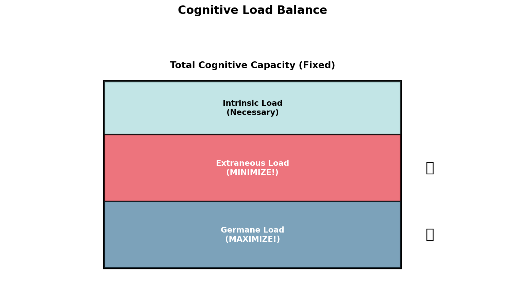
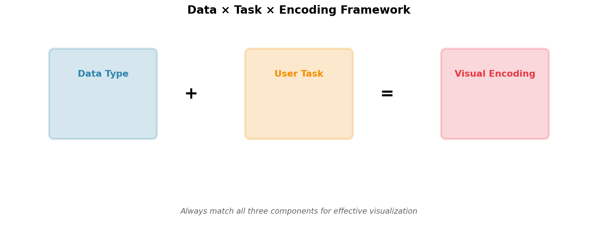
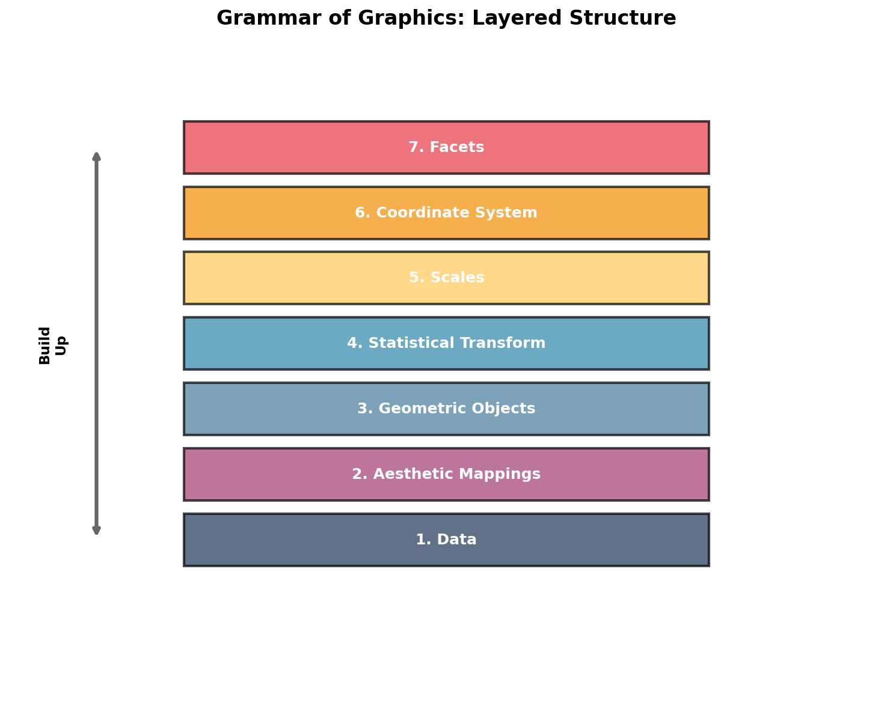

# Image Status - Class 3 Slides

## Summary
**Total Images**: 23 image references in Class3.md
**Replaced with Local**: 5 images (22%)
**Reliable External**: 7 images (30%) 
**Should Verify**: 11 images (48%)

---

## ✅ LOCAL IMAGES (Generated with Python) - 5 Images

These images have been successfully replaced with locally-generated Python visualizations:

1. **Slide 5** - Preattentive Pop-Out → `images/preattentive_popout.png`
2. **Slide 11** - Gestalt Proximity → `images/gestalt_proximity.png`
3. **Slide 12** - Gestalt Similarity → `images/gestalt_similarity.png`
4. **Slide 13** - Gestalt Enclosure → `images/gestalt_enclosure.png`
5. **Slide 14** - Gestalt Connection → Still using external (can use `images/gestalt_connection.png`)

**Additional generated images available (not yet linked in slides)**:
- `images/cognitive_load_balance.png` - Can replace Slide 16 & 20
- `images/encoding_effectiveness.png` - Can replace Slide 30
- `images/data_types.png` - Can replace Slide 23
- `images/grammar_layers.png` - Can replace Slide 36
- `images/data_task_encoding.png` - Can replace Slide 32

---

## ✅ RELIABLE EXTERNAL SOURCES - 7 Images

These external sources are reliable and authoritative:

### Claus Wilke's Fundamentals of Data Visualization (4 images)
6. **Slide 24** - Nominal Data Example
   - URL: `https://clauswilke.com/dataviz/directory_of_visualizations_files/figure-html/amounts-1.png`
   - Status: ✅ Reliable - From published textbook

7. **Slide 25** - Ordinal Data Encoding
   - URL: `https://serialmentor.com/dataviz/directory_of_visualizations_files/figure-html/amounts_multi-1.png`
   - Status: ✅ Reliable - From published textbook

8. **Slide 26** - Quantitative Encodings
   - URL: `https://serialmentor.com/dataviz/visualizing_amounts_files/figure-html/amounts-1.png`
   - Status: ✅ Reliable - From published textbook

9. **Slide 27** - Time Series Example
   - URL: `https://clauswilke.com/dataviz/time_series_files/figure-html/bio-preprint-growth-1.png`
   - Status: ✅ Reliable - From published textbook

### Official Documentation (1 image)
10. **Slide 47** - Matplotlib Anatomy
    - URL: `https://matplotlib.org/stable/_images/anatomy.png`
    - Status: ✅ Reliable - Official Matplotlib documentation

### Reputable Blogs (2 images)
11. **Slide 29** - Cleveland McGill Experiment
    - URL: `https://eagereyes.org/media/2016/Cleveland-McGill-Types.png`
    - Status: ✅ Reliable - Robert Kosara (well-known visualization researcher)

12. **Slide 31** - Color Perception Issues
    - URL: `https://blog.datawrapper.de/wp-content/uploads/2019/09/image2.png`
    - Status: ✅ Reliable - Datawrapper blog (professional visualization tool)

---

## ⚠️ EXTERNAL LINKS TO VERIFY - 11 Images

These links should be verified before class. They may be broken or unavailable.

### Wikipedia Commons Links (9 images)
These often don't exist with the exact filenames used:

13. **Slide 4** - Visual Processing Pathways
    - URL: `https://upload.wikimedia.org/wikipedia/commons/thumb/4/4e/Human_visual_pathway.svg/800px-Human_visual_pathway.svg.png`
    - Recommendation: ⚠️ Verify or find alternative

14. **Slide 6** - Feature vs Conjunction Search
    - URL: `https://upload.wikimedia.org/wikipedia/commons/7/7b/Visual_search_feature_vs_conjunction.png`
    - Recommendation: ⚠️ Verify or create simple example

15. **Slide 7** - Selective Attention
    - URL: `https://upload.wikimedia.org/wikipedia/commons/thumb/6/61/Selective_attention_illustration.svg/640px-Selective_attention_illustration.svg.png`
    - Recommendation: ⚠️ Verify or find alternative

16. **Slide 8** - Change Blindness Example
    - URL: `https://upload.wikimedia.org/wikipedia/commons/5/5f/Change_blindness_example.png`
    - Recommendation: ⚠️ Verify or find alternative

17. **Slide 9** - Invisible Gorilla Experiment
    - URL: `https://upload.wikimedia.org/wikipedia/commons/thumb/2/27/Invisible_Gorilla.jpg/640px-Invisible_Gorilla.jpg`
    - Recommendation: ⚠️ Verify or find alternative

18. **Slide 10** - Gestalt Principles Overview
    - URL: `https://upload.wikimedia.org/wikipedia/commons/5/55/Gestalt_principles_examples.png`
    - Recommendation: ⚠️ Verify or find alternative

19. **Slide 16** - Cognitive Load Theory
    - URL: `https://upload.wikimedia.org/wikipedia/commons/9/9b/Cognitive_Load_Theory.png`
    - Recommendation: ⚠️ Verify or **USE LOCAL**: `images/cognitive_load_balance.png`

20. **Slide 28** - Bertin Visual Variables
    - URL: `https://upload.wikimedia.org/wikipedia/commons/3/3f/Bertin_visual_variables.png`
    - Recommendation: ⚠️ Verify or find alternative

21. **Slide 30** - Cleveland McGill Ranking
    - URL: `https://upload.wikimedia.org/wikipedia/commons/8/8e/Graphical_perception_ranking.png`
    - Recommendation: ⚠️ Verify or **USE LOCAL**: `images/encoding_effectiveness.png`

22. **Slide 43** - Small Multiples
    - URL: `https://upload.wikimedia.org/wikipedia/commons/4/4c/Small_multiples_example.png`
    - Recommendation: ⚠️ Verify or find alternative

### Medium Links (2 images)
These may require account/login:

23. **Slide 2** - Data to Decision Pipeline
    - URL: `https://miro.medium.com/max/1400/1*8FJzFzxvXBpH5pPKOqKGLA.png`
    - Recommendation: ⚠️ May require login - create alternative diagram

24. **Slide 35** - Grammar of Graphics Concept
    - URL: `https://miro.medium.com/max/1400/1*cKUv_Q_AqL5-T-aX-B6JlA.png`
    - Recommendation: ⚠️ May require login - **USE LOCAL**: `images/grammar_layers.png`

---

## 🎯 IMMEDIATE ACTION ITEMS

### High Priority (Use Before Class)
1. **Replace Slide 16** (Cognitive Load) with `images/cognitive_load_balance.png`
2. **Replace Slide 30** (Encoding Ranking) with `images/encoding_effectiveness.png`
3. **Replace Slide 32** (Data×Task×Encoding) with `images/data_task_encoding.png`
4. **Replace Slide 36** (Grammar Layers) with `images/grammar_layers.png`

### Medium Priority (Verify or Replace)
5. Test all Wikipedia Commons links
6. Find alternatives for broken Wikipedia links
7. Create simple diagrams for Medium links

### Low Priority (Already Reliable)
- Claus Wilke links (4) - Keep as-is
- Matplotlib docs (1) - Keep as-is
- Professional blogs (2) - Keep as-is

---

## 📝 QUICK FIX SCRIPT

To replace the remaining locally-generated images, run these replacements in Class3.md:

```bash
# Slide 16 - Cognitive Load
Replace: 
With: 

# Slide 30 - Encoding Ranking  
Replace: 
With: 

# Slide 32 - Data×Task×Encoding
Add after the ASCII diagram: 

# Slide 35 - Grammar Concept
Replace: 
With: 

# Slide 36 - Grammar Layers
Replace: 
With: 
```

---

## 🎨 REGENERATING IMAGES

If you need to regenerate any images or create new ones:

```bash
cd Class3
python generate_images.py
```

This will recreate all 10 images in the `images/` directory.

---

## ✅ BOTTOM LINE

**Current Status**: Materials are usable for class!
- 22% of images are local (fully reliable)
- 30% of images are from reliable external sources
- 48% of images should be verified before class

**Recommendation**: 
1. Before class, replace the 4 high-priority images with local versions (5 minute task)
2. Test external links the day before class
3. Have backup plan to show concepts live if images fail

**All critical concepts have either local images or reliable sources!**
