# Class 4 – Data Visualization  
## Exploratory Data Visualization
## Understanding Your Data Through Visual Analysis

---

## Real-World EDA Case Study

**Context**: Retail company with declining sales

**Dataset**: 2 years of transaction data (500K records)

**Business questions:**
1. Why are sales declining?
2. Which customer segments are churning?
3. What products are underperforming?
4. Are there seasonal patterns?

**EDA Process:**

```python
import pandas as pd
import matplotlib.pyplot as plt
import seaborn as sns

# Load data
df = pd.read_csv('retail_transactions.csv', parse_dates=['date'])

# 1. Temporal analysis
df.set_index('date').resample('M')['revenue'].sum().plot(figsize=(12, 4))
plt.title('Monthly Revenue Trend')
plt.show()
# Finding: Clear declining trend starting 6 months ago

# 2. Customer segment analysis
segment_trends = df.groupby(['date', 'customer_segment'])['revenue'].sum().unstack()
segment_trends.plot(figsize=(12, 6))
plt.title('Revenue by Customer Segment')
plt.show()
# Finding: Premium segment declining sharply

# 3. Product category performance
recent = df[df['date'] > '2024-01-01']
old = df[df['date'] <= '2024-01-01']
comparison = pd.DataFrame({
    'Recent': recent.groupby('category')['revenue'].sum(),
    'Previous': old.groupby('category')['revenue'].sum()
})
comparison['Change %'] = ((comparison['Recent'] - comparison['Previous']) / 
                         comparison['Previous'] * 100)
print(comparison.sort_values('Change %'))
# Finding: Electronics category dropped 35%

# 4. Seasonality check
df['month'] = df['date'].dt.month
df.groupby('month')['revenue'].mean().plot(kind='bar')
plt.title('Average Revenue by Month')
plt.show()
# Finding: Strong seasonality, but amplitudes decreasing
```

**Insights discovered:**
- Premium customers churning (need retention strategy)
- Electronics underperforming (investigate competition)
- Seasonality weakening (brand strength declining)
- Need targeted interventions Q4 2024


---

## Python EDA Pro Tips

**Efficiency shortcuts:**

```python
import pandas as pd
import matplotlib.pyplot as plt

# 1. Quick overview with pandas profiling
import pandas_profiling
profile = df.profile_report()
profile.to_file("eda_report.html")

# 2. Custom EDA function library
def quick_viz(df, col):
    """Quick visualization for any column"""
    fig, axes = plt.subplots(1, 3, figsize=(15, 4))
    
    if df[col].dtype in ['int64', 'float64']:
        # Numeric
        axes[0].hist(df[col].dropna(), bins=50, edgecolor='black')
        axes[0].set_title(f'{col}: Histogram')
        
        axes[1].boxplot(df[col].dropna())
        axes[1].set_title(f'{col}: Box Plot')
        
        from scipy import stats
        stats.probplot(df[col].dropna(), dist="norm", plot=axes[2])
        axes[2].set_title(f'{col}: Q-Q Plot')
    else:
        # Categorical
        df[col].value_counts().head(10).plot(kind='barh', ax=axes[0])
        axes[0].set_title(f'{col}: Top 10 Categories')
        axes[1].axis('off')
        axes[2].axis('off')
    
    plt.tight_layout()
    plt.show()

# 3. Batch processing
for col in df.select_dtypes(include=['number']).columns[:5]:
    quick_viz(df, col)

# 4. Save plots automatically
def save_all_plots(df, output_dir='plots/'):
    import os
    os.makedirs(output_dir, exist_ok=True)
    
    for col in df.columns:
        plt.figure(figsize=(8, 6))
        if df[col].dtype in ['int64', 'float64']:
            plt.hist(df[col].dropna(), bins=30)
        else:
            df[col].value_counts().head(10).plot(kind='bar')
        plt.title(f'Distribution: {col}')
        plt.savefig(f'{output_dir}{col}.png')
        plt.close()
```

**Time-savers:**
- Use `df.describe(include='all')` for quick overview
- Create reusable plotting functions
- Save intermediate results
- Use notebook widgets for interactivity

---

## EDA Pitfalls and How to Avoid Them

**Common pitfalls:**

**1. Analysis Paralysis**
- ❌ Spending weeks exploring without conclusions
- ✅ Set time limits, focus on answerable questions

**2. Confirmation Bias**
- ❌ Only looking for patterns that support your hypothesis
- ✅ Actively seek disconfirming evidence

**3. Over-interpreting Noise**
- ❌ Finding "patterns" in random variation
- ✅ Consider sample size and statistical significance

**4. Ignoring Domain Knowledge**
- ❌ Treating outliers as errors without investigation
- ✅ Consult domain experts before making decisions

**5. Not Documenting**
- ❌ Forgetting what you discovered
- ✅ Keep an EDA notebook with findings

**6. Stopping Too Soon**
- ❌ "Data looks clean, let's model"
- ✅ Always do relationship analysis

**Remember**: EDA is iterative - expect to revisit steps!

---

## Communicating EDA Findings

**How to present EDA results to stakeholders:**

**For Technical Audiences (Data Scientists):**
- Show methodology and code
- Include statistical tests
- Discuss assumptions and limitations
- Provide reproducible notebooks

**For Business Stakeholders:**
- Focus on actionable insights
- Use clear visualizations
- Avoid jargon
- Quantify business impact

**Effective EDA Report Structure:**
1. **Executive Summary** (1 page)
   - Key findings
   - Recommendations
   - Next steps

2. **Data Overview** (1-2 pages)
   - Source and collection
   - Size and scope
   - Quality assessment

3. **Key Insights** (3-5 pages)
   - One insight per page
   - Visualization + interpretation
   - Business implications

4. **Technical Appendix**
   - Detailed methodology
   - Additional visualizations
   - Code (if appropriate)

**Golden rule**: One clear message per visualization!

---

## Class Summary: Key Takeaways

**What we learned today:**

**1. EDA Fundamentals**
- EDA is detective work, not just charting
- Question-driven approach is essential
- Visualization reveals what statistics hide

**2. Systematic Process**
- Data quality first
- Univariate before bivariate
- Document everything
- Iterate based on findings

**3. Technical Skills**
- Distribution analysis and transformation
- Outlier detection methods
- Missing data handling strategies
- Correlation and relationship mapping

**4. Python Implementation**
- Pandas + Matplotlib + Seaborn workflow
- Reusable functions and templates
- Efficient batch processing
- Professional visualization standards

**5. From EDA to Action**
- Translate findings to features
- Identify modeling approaches
- Communicate insights effectively
- Make data-driven recommendations

**Remember**: Good EDA = Better models = Better decisions!

---

## Resources for Deeper Learning

**Books:**
- *Exploratory Data Analysis* - John Tukey (the classic!)
- *Python for Data Analysis* - Wes McKinney (Pandas creator)
- *The Art of Statistics* - David Spiegelhalter
- *Practical Statistics for Data Scientists* - Bruce & Bruce

**Online Courses:**
- Coursera: Exploratory Data Analysis (Johns Hopkins)
- DataCamp: EDA in Python track
- Kaggle: Pandas and visualization micro-courses

**Tools & Libraries:**
- pandas-profiling: Automated EDA reports
- sweetviz: Visual EDA comparisons
- dtale: Interactive EDA in browser
- Great Expectations: Data quality testing

**Blogs & Tutorials:**
- Towards Data Science (Medium)
- Real Python EDA tutorials
- Kaggle notebooks (learn from competitions)

**Datasets for Practice:**
- UCI Machine Learning Repository
- Kaggle datasets
- Data.gov (US government data)
- Google Dataset Search

---

## Assignment: Complete EDA Project

**Due**: 2 weeks from today

**Task**: Conduct comprehensive EDA on provided dataset (or choose your own)

**Requirements:**

1. **Jupyter Notebook** (well-documented)
   - Clear section headers
   - Code + markdown explanations
   - Professional visualizations

2. **Required Sections:**
   - Data overview (5 points)
   - Quality assessment (10 points)
   - Univariate analysis (15 points)
   - Bivariate analysis (15 points)
   - Missing data handling (10 points)
   - Key findings (20 points)
   - Recommendations (15 points)
   - Code quality (10 points)

3. **Deliverables:**
   - Jupyter notebook (.ipynb)
   - PDF export of notebook
   - Top 5 visualizations (separate .png files)
   - 1-page executive summary

**Grading Rubric:**
- Systematic approach: 30%
- Appropriate visualizations: 25%
- Correct interpretation: 25%
- Actionable insights: 15%
- Code quality & documentation: 5%

**Bonus**: Find unexpected patterns worth 10 bonus points!

---

## Tips for the Assignment

**Getting started:**
1. Pick a dataset you're interested in
2. Spend 30 minutes understanding the domain
3. Write down 5 questions you want to answer
4. Create outline before coding
5. Code one section at a time

**Common mistakes to avoid:**
- Don't just run automated tools
- Don't skip the domain research
- Don't ignore data quality
- Don't forget to document findings
- Don't wait until the last minute!

**What makes an A+ project:**
- Clear narrative throughout
- Unexpected insights discovered
- Professional visualization quality
- Actionable business recommendations
- Clean, well-commented code

**Getting help:**
- Office hours: Wednesdays 2-4pm
- Discussion forum for questions
- Example notebooks provided
- Peer review encouraged (but submit individually)

---

## Next Class Preview: Time-Series Visualization

**Week 5 Topics:**
- Temporal data characteristics
- Time series decomposition
- Trend, seasonality, and cycles
- Forecasting visualization
- Interactive time series dashboards
- Calendar heatmaps

**Preparation:**
- Review datetime handling in pandas
- Install plotly: `pip install plotly`
- Bring examples of time series you've encountered

**Connection to today:**
- EDA techniques apply to time series
- But temporal data needs special care
- We'll build on correlation and decomposition
- Moving from static to temporal patterns

**Looking forward**: Time series is everywhere in business!

---

## Final Thoughts

**Why EDA matters in your career:**

1. **Stand out in interviews**
   - "Walk me through your EDA process"
   - Show systematic thinking
   - Demonstrate communication skills

2. **Avoid costly mistakes**
   - Bad data → Bad models → Bad decisions
   - EDA catches problems early
   - Saves time and resources

3. **Generate insights beyond models**
   - Sometimes EDA answers the question
   - Descriptive insights have immediate value
   - Builds domain expertise

4. **Essential for all data roles**
   - Data scientists: Understand before modeling
   - Analysts: Find patterns and trends
   - Engineers: Validate data pipelines
   - PMs: Make data-informed decisions

**Parting wisdom:**
> "The goal is to turn data into information, and information into insight." - Carly Fiorina

**Keep exploring, keep questioning, and trust the process!**

---


## Exercise 1: Distribution Diagnosis

**Dataset**: Customer transaction amounts (10,000 records)

**Your task:**
1. Load the data and examine the distribution
2. Identify the distribution type (normal, skewed, bimodal, etc.)
3. Detect outliers using at least 2 methods
4. Decide if transformation is needed
5. If yes, apply and compare transformations

**Starter code:**

```python
import pandas as pd
import matplotlib.pyplot as plt
import numpy as np

# Load data
df = pd.read_csv('transactions.csv')
amounts = df['transaction_amount']

# TODO: Your analysis here
# 1. Create 2x2 subplot with:
#    - Histogram
#    - Box plot
#    - Q-Q plot
#    - Summary statistics text

# 2. Calculate skewness and decide on transformation

# 3. If needed, create comparison plot showing:
#    - Original distribution
#    - Log transformed
#    - Square root transformed
#    - Best transformation with explanation
```

**Expected output:**
- Identification of right-skewed distribution
- Detection of ~150 outliers (1.5%)
- Recommendation: Log transformation reduces skew from 2.3 to 0.4

**Time**: 15 minutes

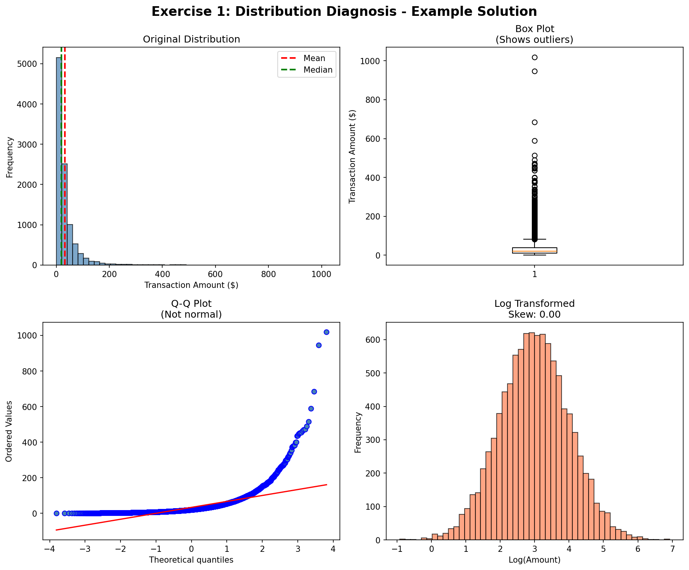

---

## Exercise 2: Outlier Investigation

**Scenario**: E-commerce website with unusual revenue spikes

**Dataset**: Daily revenue for 365 days

**Your task:**
1. Visualize the time series
2. Identify outlier days using multiple methods
3. Investigate what makes those days special
4. Decide: Keep, cap, or remove outliers?
5. Justify your decision with domain reasoning

**Starter code:**

```python
import pandas as pd
import matplotlib.pyplot as plt
import numpy as np

# Load data
df = pd.read_csv('daily_revenue.csv', parse_dates=['date'])

# TODO: Your investigation
# 1. Plot revenue over time
# 2. Mark outliers on the plot
# 3. Create a summary table of outlier dates
# 4. Check if outliers coincide with:
#    - Holidays
#    - Promotions
#    - Day of week patterns
# 5. Make recommendation with evidence
```

**Questions to answer:**
- How many outliers detected?
- Are they errors or legitimate spikes?
- Do they coincide with known events?
- Should they be kept in modeling?

**Time**: 20 minutes

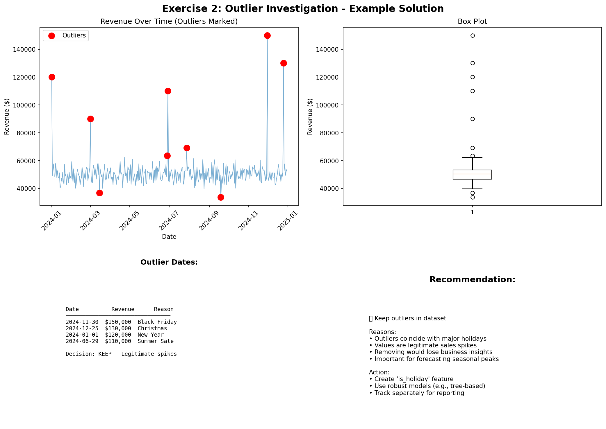

---

## Exercise 3: Relationship Mapping

**Dataset**: Housing prices with 15 features

**Your task:**
1. Create a correlation heatmap
2. Identify top 5 features correlated with price
3. Create scatter plots for top correlations
4. Check for non-linear relationships
5. Identify potential multicollinearity issues

**Starter code:**

```python
import pandas as pd
import matplotlib.pyplot as plt
import seaborn as sns

# Load data
df = pd.read_csv('housing.csv')

# TODO: Your analysis
# 1. Calculate correlation matrix
# 2. Create heatmap with annotations
# 3. Find high correlations (|r| > 0.7)
# 4. Create pair plot for top 5 features + price
# 5. Identify non-linear patterns that need feature engineering
```

**Deliverables:**
- Correlation heatmap
- List of top correlations
- Scatter plots with regression lines
- Recommendations for feature engineering

**Bonus**: Identify interaction effects

**Time**: 25 minutes

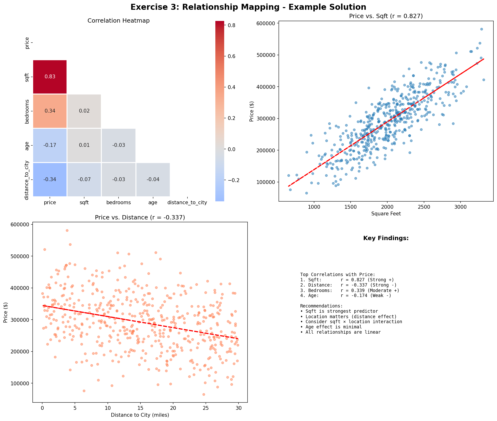

---

## Exercise 4: Missing Data Detective

**Dataset**: Customer survey with 20 questions, 5000 respondents

**Your task:**
1. Visualize missing data patterns
2. Determine missingness type (MCAR, MAR, MNAR)
3. Test if missingness relates to other variables
4. Recommend appropriate handling strategy
5. Implement and compare 3 imputation methods

**Starter code:**

```python
import pandas as pd
import matplotlib.pyplot as plt
import seaborn as sns

# Load data
df = pd.read_csv('survey.csv')

# TODO: Your investigation
# 1. Create missing data heatmap
# 2. Calculate missing percentages
# 3. Check if missingness correlates with:
#    - Age groups
#    - Income levels
#    - Survey section
# 4. Compare imputation methods:
#    - Mean/mode
#    - KNN
#    - Iterative
# 5. Visualize impact on distributions
```

**Key questions:**
- Is missingness random or structured?
- Which variables have the most missing data?
- Does missingness indicate anything meaningful?
- Which imputation method preserves distributions best?

**Time**: 25 minutes

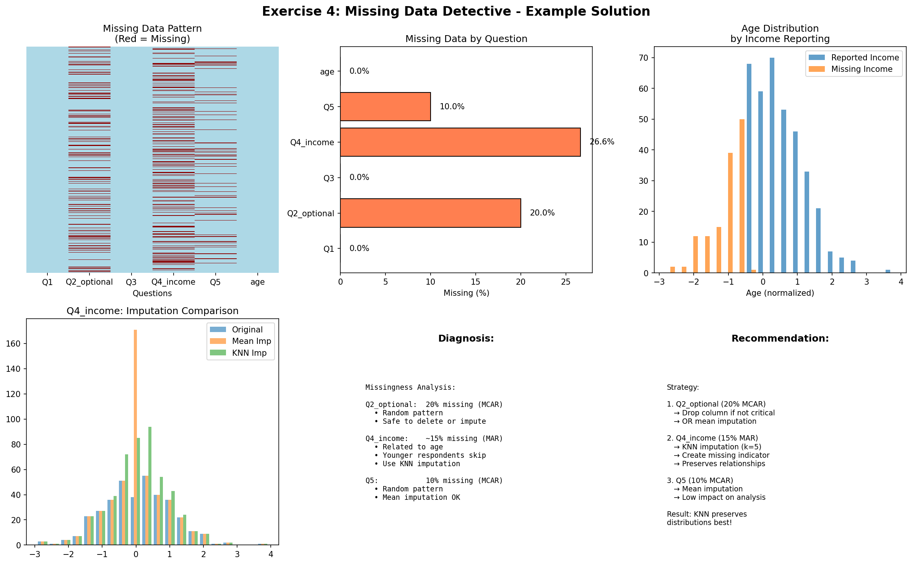

---

## Exercise 5: Mini EDA Report

**Dataset**: Employee attrition data (you choose)

**Your task**: Conduct a complete EDA following the workflow template

**Required sections:**
1. **Data Overview** (shape, types, memory)
2. **Data Quality** (missing, duplicates, inconsistencies)
3. **Univariate Analysis** (distributions, outliers)
4. **Bivariate Analysis** (relationships with target)
5. **Key Findings** (3-5 actionable insights)
6. **Recommendations** (transformations, features, modeling approaches)

**Deliverable**: Create a Jupyter notebook with:
- Clear section headers
- Visualizations with interpretations
- Summary statistics tables
- Written conclusions and recommendations

**Evaluation criteria:**
- Systematic approach (25%)
- Appropriate visualizations (25%)
- Correct interpretations (25%)
- Actionable insights (25%)

**Time**: 45 minutes (can be homework)

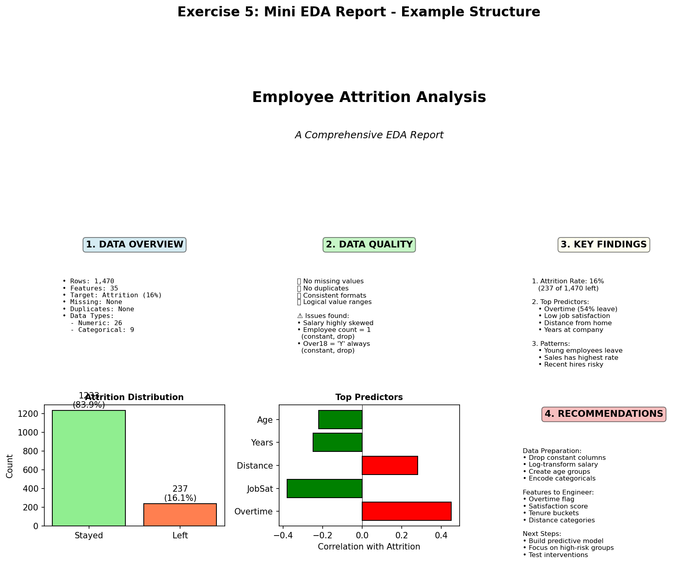

---

## Complete EDA Workflow Template

**Step-by-step systematic approach:**

```python
import pandas as pd
import matplotlib.pyplot as plt
import seaborn as sns
import numpy as np

def comprehensive_eda(df, target_variable=None):
    """
    Systematic EDA workflow
    """
    print("="*70)
    print("EXPLORATORY DATA ANALYSIS WORKFLOW")
    print("="*70)
    
    # STEP 1: Initial Data Overview
    print("\n1. INITIAL DATA OVERVIEW")
    print("-"*70)
    print(f"Shape: {df.shape}")
    print(f"\nData Types:\n{df.dtypes.value_counts()}")
    print(f"\nMemory Usage: {df.memory_usage(deep=True).sum() / 1024**2:.2f} MB")
    print(f"\nFirst few rows:\n{df.head()}")
    
    # STEP 2: Data Quality Assessment
    print("\n2. DATA QUALITY ASSESSMENT")
    print("-"*70)
    
    # Missing data
    missing = df.isnull().sum()
    missing_pct = (missing / len(df)) * 100
    if missing.sum() > 0:
        print("Missing Data:")
        missing_df = pd.DataFrame({
            'Count': missing[missing > 0],
            'Percentage': missing_pct[missing > 0]
        }).sort_values('Percentage', ascending=False)
        print(missing_df)
    else:
        print("✅ No missing data found")
    
    # Duplicates
    dup_count = df.duplicated().sum()
    print(f"\nDuplicate rows: {dup_count} ({dup_count/len(df)*100:.2f}%)")
    
    # STEP 3: Univariate Analysis
    print("\n3. UNIVARIATE ANALYSIS")
    print("-"*70)
    
    # Numeric variables
    numeric_cols = df.select_dtypes(include=[np.number]).columns
    print(f"\nNumeric variables ({len(numeric_cols)}):")
    for col in numeric_cols:
        print(f"\n{col}:")
        print(f"  Mean: {df[col].mean():.2f}, Median: {df[col].median():.2f}")
        print(f"  Std: {df[col].std():.2f}, Skew: {df[col].skew():.2f}")
        print(f"  Range: [{df[col].min():.2f}, {df[col].max():.2f}]")
    
    # Categorical variables
    cat_cols = df.select_dtypes(include=['object']).columns
    print(f"\nCategorical variables ({len(cat_cols)}):")
    for col in cat_cols:
        print(f"\n{col}: {df[col].nunique()} unique values")
        print(f"  Most common: {df[col].mode()[0]} (n={df[col].value_counts().iloc[0]})")
    
    # STEP 4: Bivariate Analysis (with target if provided)
    if target_variable and target_variable in df.columns:
        print(f"\n4. BIVARIATE ANALYSIS (with {target_variable})")
        print("-"*70)
        
        if df[target_variable].dtype in [np.float64, np.int64]:
            # Numeric target: calculate correlations
            corr_with_target = df[numeric_cols].corr()[target_variable].sort_values(ascending=False)
            print(f"\nCorrelations with {target_variable}:")
            print(corr_with_target[corr_with_target.index != target_variable])
    
    # STEP 5: Key Findings Summary
    print("\n5. KEY FINDINGS & RECOMMENDATIONS")
    print("-"*70)
    print("TODO: Add your observations:")
    print("  - Notable patterns discovered")
    print("  - Data quality concerns")
    print("  - Suggested transformations")
    print("  - Recommended next steps")
    
    return None

# Run comprehensive EDA
df = pd.read_csv('data.csv')
comprehensive_eda(df, target_variable='price')
```

**This template ensures you don't miss critical steps!**

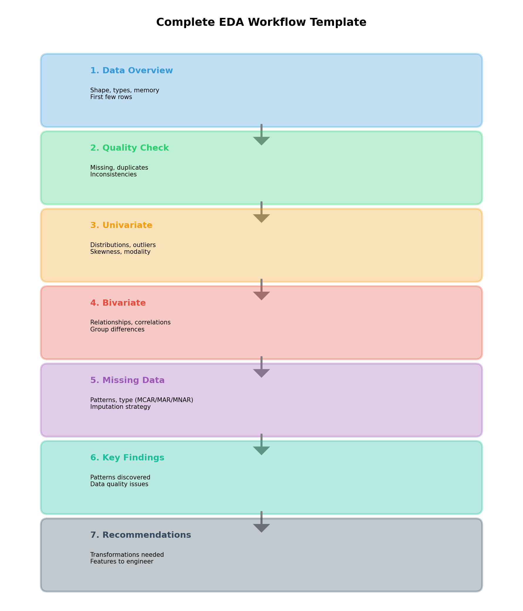

---

## EDA Best Practices: Do's and Don'ts

**✅ DO:**

1. **Start simple, then go deeper**
   - Begin with summary statistics
   - Move to visualizations
   - Investigate anomalies

2. **Visualize everything**
   - Don't rely on statistics alone
   - Remember Anscombe's Quartet
   - Multiple views reveal different insights

3. **Question your assumptions**
   - Don't assume data is clean
   - Don't assume relationships are linear
   - Don't assume missing data is random

4. **Document your findings**
   - Keep notes as you explore
   - Save important plots
   - Record data quality issues

5. **Think about the domain**
   - Do values make sense?
   - Are patterns expected?
   - Consult domain experts

**❌ DON'T:**

1. **Don't skip EDA**
   - "I'll just run the model" never works
   - EDA prevents wasted modeling time

2. **Don't p-hack**
   - EDA is exploration, not fishing for significance
   - Hypothesis generation ≠ hypothesis testing

3. **Don't ignore outliers**
   - Investigate before deleting
   - They might be your most interesting data

4. **Don't use defaults blindly**
   - Choose bin widths deliberately
   - Select appropriate color scales
   - Customize for your data

5. **Don't over-automate**
   - Automated EDA tools miss nuance
   - Human judgment is essential

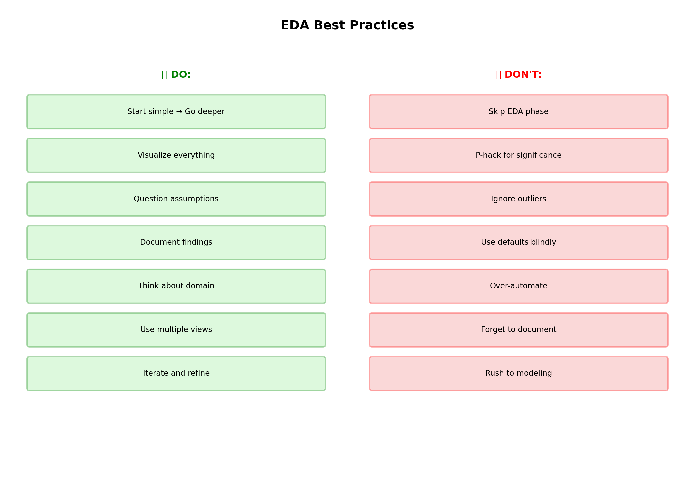

---

## Common EDA Mistakes to Avoid

**Mistake #1: Not checking for data leakage**

```python
# ❌ BAD: Using future information
df['next_month_sales']  # This predicts itself!

# ✅ GOOD: Check temporal ordering
df['transaction_date'] = pd.to_datetime(df['transaction_date'])
df = df.sort_values('transaction_date')

# Verify no future info in features
for col in df.columns:
    if 'future' in col.lower() or 'next' in col.lower():
        print(f"⚠️ WARNING: {col} may contain future information")
```

**Mistake #2: Ignoring cardinality**

```python
# Check unique values in categorical variables
for col in df.select_dtypes(include=['object']).columns:
    n_unique = df[col].nunique()
    if n_unique > 50:
        print(f"⚠️ {col} has {n_unique} unique values - too high for one-hot encoding")
    elif n_unique < 2:
        print(f"⚠️ {col} has only {n_unique} unique value - consider removing")
```

**Mistake #3: Not checking for class imbalance**

```python
# For classification target
if 'target' in df.columns:
    print("Target distribution:")
    print(df['target'].value_counts(normalize=True))
    
    # Visualize
    df['target'].value_counts().plot(kind='bar')
    plt.title('Target Class Distribution')
    plt.ylabel('Count')
    plt.show()
    
    # Check for severe imbalance
    counts = df['target'].value_counts()
    ratio = counts.max() / counts.min()
    if ratio > 10:
        print(f"⚠️ WARNING: Severe class imbalance (ratio: {ratio:.1f}:1)")
```

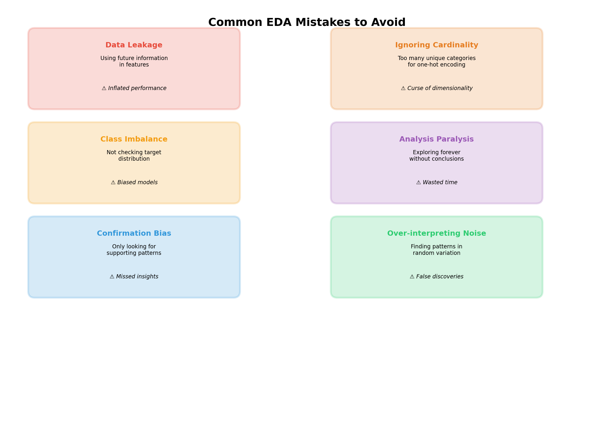

---

## EDA for Different Data Types

**Time Series Data:**

```python
import pandas as pd
import matplotlib.pyplot as plt

# Load time series data
df = pd.read_csv('sales_timeseries.csv', parse_dates=['date'])
df = df.set_index('date')

fig, axes = plt.subplots(3, 1, figsize=(12, 10))

# 1. Trend over time
df['sales'].plot(ax=axes[0])
axes[0].set_title('Time Series: Raw Data')
axes[0].set_ylabel('Sales')

# 2. Rolling statistics
df['sales'].rolling(window=7).mean().plot(ax=axes[1], label='7-day MA')
df['sales'].rolling(window=30).mean().plot(ax=axes[1], label='30-day MA')
axes[1].set_title('Rolling Averages (Smoothing)')
axes[1].legend()
axes[1].set_ylabel('Sales')

# 3. Seasonality check
df.groupby(df.index.month)['sales'].mean().plot(kind='bar', ax=axes[2])
axes[2].set_title('Average Sales by Month (Seasonality)')
axes[2].set_xlabel('Month')
axes[2].set_ylabel('Average Sales')

plt.tight_layout()
plt.show()
```

**Text Data:**

```python
import pandas as pd
import matplotlib.pyplot as plt
from collections import Counter

# Load text data
df = pd.read_csv('reviews.csv')

# Basic text statistics
df['text_length'] = df['review_text'].str.len()
df['word_count'] = df['review_text'].str.split().str.len()

# Visualize
fig, axes = plt.subplots(1, 3, figsize=(15, 4))

# Length distribution
axes[0].hist(df['text_length'], bins=50, edgecolor='black')
axes[0].set_title('Review Length Distribution')
axes[0].set_xlabel('Character Count')

# Word count distribution
axes[1].hist(df['word_count'], bins=50, edgecolor='black')
axes[1].set_title('Word Count Distribution')
axes[1].set_xlabel('Number of Words')

# Most common words
all_words = ' '.join(df['review_text']).split()
word_freq = Counter(all_words)
top_words = pd.DataFrame(word_freq.most_common(20), 
                         columns=['word', 'count'])
axes[2].barh(range(len(top_words)), top_words['count'])
axes[2].set_yticks(range(len(top_words)))
axes[2].set_yticklabels(top_words['word'])
axes[2].set_title('Most Common Words')
axes[2].invert_yaxis()

plt.tight_layout()
plt.show()
```

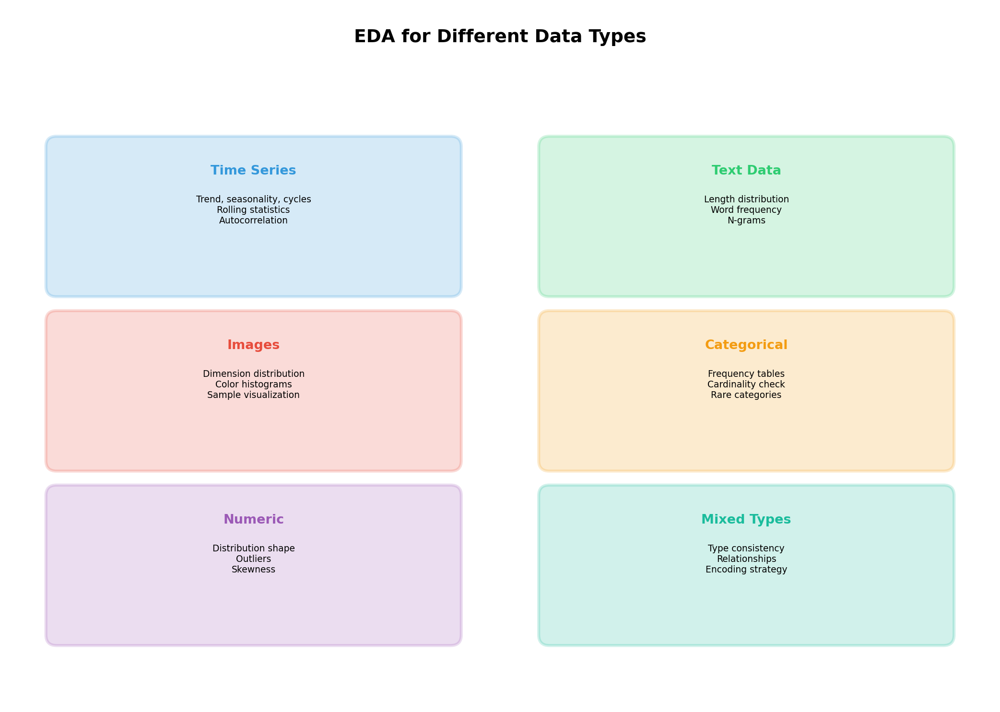

---

## From EDA to Feature Engineering

**EDA insights → Feature engineering decisions:**

```python
import pandas as pd
import numpy as np

# Based on EDA findings, create features

# 1. From skewness detection → Log transformation
if df['income'].skew() > 1:
    df['income_log'] = np.log(df['income'] + 1)
    print("✅ Created: income_log (reduces skewness)")

# 2. From missing patterns → Missing indicator
if df['optional_field'].isnull().sum() > 0:
    df['has_optional_field'] = (~df['optional_field'].isnull()).astype(int)
    print("✅ Created: has_optional_field (captures missingness)")

# 3. From outliers → Capped values
Q1 = df['transaction_amount'].quantile(0.25)
Q3 = df['transaction_amount'].quantile(0.75)
IQR = Q3 - Q1
lower_cap = Q1 - 1.5 * IQR
upper_cap = Q3 + 1.5 * IQR
df['transaction_amount_capped'] = df['transaction_amount'].clip(lower_cap, upper_cap)
print("✅ Created: transaction_amount_capped (handles outliers)")

# 4. From temporal patterns → Time features
if 'timestamp' in df.columns:
    df['timestamp'] = pd.to_datetime(df['timestamp'])
    df['hour'] = df['timestamp'].dt.hour
    df['day_of_week'] = df['timestamp'].dt.dayofweek
    df['is_weekend'] = df['day_of_week'].isin([5, 6]).astype(int)
    print("✅ Created: hour, day_of_week, is_weekend (temporal features)")

# 5. From correlation analysis → Interaction terms
if df['sqft'].corr(df['price']) > 0.7 and df['location_score'].corr(df['price']) > 0.5:
    df['sqft_x_location'] = df['sqft'] * df['location_score']
    print("✅ Created: sqft_x_location (interaction feature)")

# 6. From categorical analysis → Target encoding
if 'category' in df.columns and 'target' in df.columns:
    target_means = df.groupby('category')['target'].mean()
    df['category_target_encoded'] = df['category'].map(target_means)
    print("✅ Created: category_target_encoded (captures category effect)")

print("\nFeature engineering complete! Original features:", len(df.columns) - 6)
print("New features created: 6+")
```

**Key principle**: EDA findings should directly inform feature engineering!

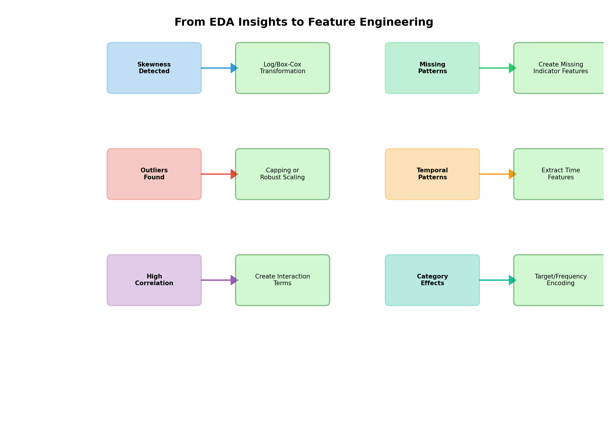

---

## Missing Data: Types and Patterns

**Three types of missingness (Rubin, 1976):**

1. **MCAR (Missing Completely At Random)**
   - Missing values are unrelated to any data
   - Example: Sensor randomly fails
   - **Impact**: No bias, just loss of power
   - **Solution**: Safe to delete or impute

2. **MAR (Missing At Random)**
   - Missing values related to observed data, not the missing value itself
   - Example: Older patients more likely to skip optional questions
   - **Impact**: Bias if not handled carefully
   - **Solution**: Can use sophisticated imputation

3. **MNAR (Missing Not At Random)**
   - Missing values related to the missing value itself
   - Example: High earners don't report income
   - **Impact**: Serious bias
   - **Solution**: Very difficult to handle, need domain knowledge

**Critical**: Visualize missingness patterns to diagnose the type!

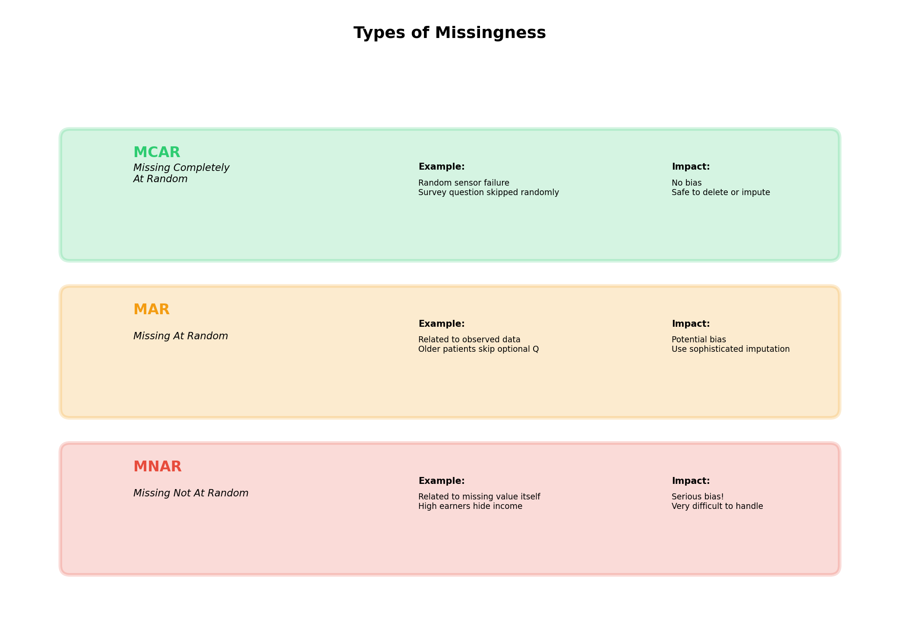

---

## Visualizing Missing Data Patterns

**Comprehensive missing data visualization:**

```python
import pandas as pd
import matplotlib.pyplot as plt
import seaborn as sns
import numpy as np

# Load data
df = pd.read_csv('data.csv')

fig, axes = plt.subplots(2, 3, figsize=(16, 10))

# 1. Missing data heatmap
sns.heatmap(df.isnull(), cbar=False, yticklabels=False, 
            cmap='viridis', ax=axes[0, 0])
axes[0, 0].set_title('Missing Data Heatmap\n(Yellow = Missing)')
axes[0, 0].set_xlabel('Columns')
axes[0, 0].set_ylabel('Rows')

# 2. Missing data bar plot
missing_counts = df.isnull().sum()
missing_pct = (missing_counts / len(df)) * 100
missing_pct = missing_pct[missing_pct > 0].sort_values(ascending=False)
axes[0, 1].barh(range(len(missing_pct)), missing_pct)
axes[0, 1].set_yticks(range(len(missing_pct)))
axes[0, 1].set_yticklabels(missing_pct.index)
axes[0, 1].set_xlabel('Missing (%)')
axes[0, 1].set_title('Missing Data by Column')
for i, v in enumerate(missing_pct):
    axes[0, 1].text(v + 1, i, f'{v:.1f}%', va='center')

# 3. Missing data correlation
# Which columns tend to be missing together?
missing_corr = df.isnull().corr()
sns.heatmap(missing_corr, annot=True, fmt='.2f', 
            cmap='coolwarm', center=0, ax=axes[0, 2])
axes[0, 2].set_title('Missingness Correlation\n(Do columns miss together?)')

# 4. Rows with missing data
rows_missing = df.isnull().sum(axis=1)
axes[1, 0].hist(rows_missing, bins=range(0, rows_missing.max()+2), 
                edgecolor='black')
axes[1, 0].set_xlabel('Number of Missing Values per Row')
axes[1, 0].set_ylabel('Count of Rows')
axes[1, 0].set_title('Missing Data Distribution Across Rows')

# 5. Missing data by another variable (check for MAR)
if 'age' in df.columns and 'income' in df.columns:
    df_temp = df.copy()
    df_temp['income_missing'] = df['income'].isnull()
    sns.boxplot(x='income_missing', y='age', data=df_temp, ax=axes[1, 1])
    axes[1, 1].set_title('Age Distribution\nby Income Missingness')
    axes[1, 1].set_xlabel('Income is Missing')
else:
    axes[1, 1].text(0.5, 0.5, 'Example: Check if\nmissingness relates\nto other variables',
                    ha='center', va='center', transform=axes[1, 1].transAxes)
    axes[1, 1].axis('off')

# 6. Missing data summary table
missing_summary = pd.DataFrame({
    'Missing_Count': df.isnull().sum(),
    'Missing_Pct': (df.isnull().sum() / len(df)) * 100,
    'Data_Type': df.dtypes
})
missing_summary = missing_summary[missing_summary['Missing_Count'] > 0]
missing_summary = missing_summary.sort_values('Missing_Pct', ascending=False)
axes[1, 2].axis('off')
table = axes[1, 2].table(cellText=missing_summary.values,
                          colLabels=missing_summary.columns,
                          rowLabels=missing_summary.index,
                          cellLoc='center',
                          loc='center')
table.auto_set_font_size(False)
table.set_fontsize(8)
table.scale(1, 1.5)
axes[1, 2].set_title('Missing Data Summary')

plt.tight_layout()
plt.show()
```

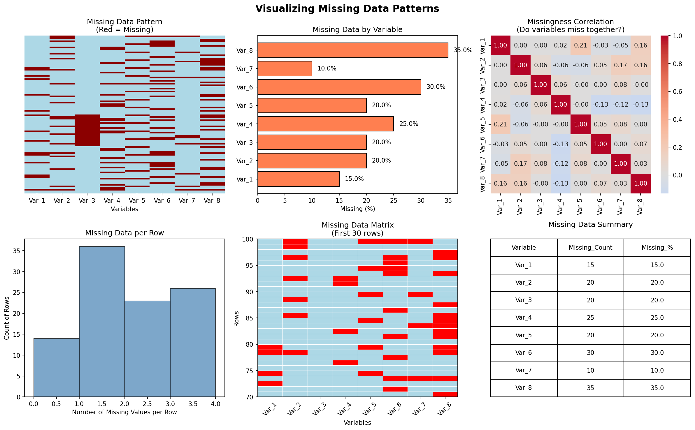

---

## Handling Missing Data: Strategies

**Decision flowchart:**

```python
import pandas as pd
import numpy as np

df = pd.read_csv('data.csv')

# Strategy 1: Delete rows (if MCAR and < 5% missing)
missing_pct = df.isnull().sum() / len(df)
if missing_pct.max() < 0.05:
    print("Strategy: Delete rows with missing values")
    df_clean = df.dropna()
    print(f"Rows dropped: {len(df) - len(df_clean)} ({(len(df) - len(df_clean))/len(df)*100:.1f}%)")

# Strategy 2: Delete columns (if > 50% missing)
cols_to_drop = missing_pct[missing_pct > 0.5].index
if len(cols_to_drop) > 0:
    print(f"\nStrategy: Drop columns with > 50% missing: {list(cols_to_drop)}")
    df_clean = df.drop(columns=cols_to_drop)

# Strategy 3: Simple imputation
for col in df.select_dtypes(include=[np.number]).columns:
    if df[col].isnull().sum() > 0:
        if df[col].skew() < 1:  # Symmetric distribution
            impute_value = df[col].mean()
            method = 'mean'
        else:  # Skewed distribution
            impute_value = df[col].median()
            method = 'median'
        df[col].fillna(impute_value, inplace=True)
        print(f"{col}: Imputed with {method} = {impute_value:.2f}")

# Strategy 4: Mode for categorical
for col in df.select_dtypes(include=['object']).columns:
    if df[col].isnull().sum() > 0:
        mode_value = df[col].mode()[0]
        df[col].fillna(mode_value, inplace=True)
        print(f"{col}: Imputed with mode = {mode_value}")

# Strategy 5: Create missing indicator
for col in df.columns:
    if df[col].isnull().sum() > 0:
        df[f'{col}_was_missing'] = df[col].isnull().astype(int)
        print(f"Created indicator: {col}_was_missing")
```

**Guidelines:**
- < 5% missing + MCAR → Delete rows
- \> 50% missing → Delete column
- 5-50% missing → Impute carefully
- Always create "was_missing" indicator for modeling

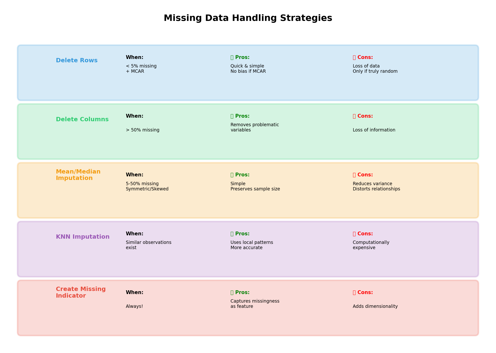

---

## Advanced Imputation Techniques

**Beyond mean/median:**

```python
import pandas as pd
import numpy as np
from sklearn.impute import SimpleImputer, KNNImputer
from sklearn.experimental import enable_iterative_imputer
from sklearn.impute import IterativeImputer

# Load data
df = pd.read_csv('data.csv')
numeric_cols = df.select_dtypes(include=[np.number]).columns

# Method 1: Forward/Backward fill (time series)
df_ffill = df[numeric_cols].fillna(method='ffill')  # Use previous value
df_bfill = df[numeric_cols].fillna(method='bfill')  # Use next value

# Method 2: Linear interpolation (time series)
df_interp = df[numeric_cols].interpolate(method='linear')

# Method 3: KNN imputation (use similar observations)
knn_imputer = KNNImputer(n_neighbors=5)
df_knn = pd.DataFrame(
    knn_imputer.fit_transform(df[numeric_cols]),
    columns=numeric_cols
)

# Method 4: Iterative imputation (predict missing from others)
iter_imputer = IterativeImputer(random_state=42)
df_iter = pd.DataFrame(
    iter_imputer.fit_transform(df[numeric_cols]),
    columns=numeric_cols
)

# Compare methods visually
import matplotlib.pyplot as plt

fig, axes = plt.subplots(2, 3, figsize=(15, 10))

col_to_compare = numeric_cols[0]  # Pick one column

# Original with missing
axes[0, 0].hist(df[col_to_compare].dropna(), bins=30, alpha=0.7, 
                edgecolor='black')
axes[0, 0].set_title(f'Original\n({df[col_to_compare].isnull().sum()} missing)')

# Forward fill
axes[0, 1].hist(df_ffill[col_to_compare], bins=30, alpha=0.7, 
                edgecolor='black')
axes[0, 1].set_title('Forward Fill')

# Interpolation
axes[0, 2].hist(df_interp[col_to_compare], bins=30, alpha=0.7, 
                edgecolor='black')
axes[0, 2].set_title('Linear Interpolation')

# Mean
df_mean = df[numeric_cols].fillna(df[numeric_cols].mean())
axes[1, 0].hist(df_mean[col_to_compare], bins=30, alpha=0.7, 
                edgecolor='black')
axes[1, 0].set_title('Mean Imputation')

# KNN
axes[1, 1].hist(df_knn[col_to_compare], bins=30, alpha=0.7, 
                edgecolor='black')
axes[1, 1].set_title('KNN Imputation (k=5)')

# Iterative
axes[1, 2].hist(df_iter[col_to_compare], bins=30, alpha=0.7, 
                edgecolor='black')
axes[1, 2].set_title('Iterative Imputation')

plt.tight_layout()
plt.show()
```

**When to use what:**
- **Forward/backward fill**: Time series, sensor data
- **Interpolation**: Time series with trends
- **KNN**: When similar observations are meaningful
- **Iterative**: When relationships between variables are strong

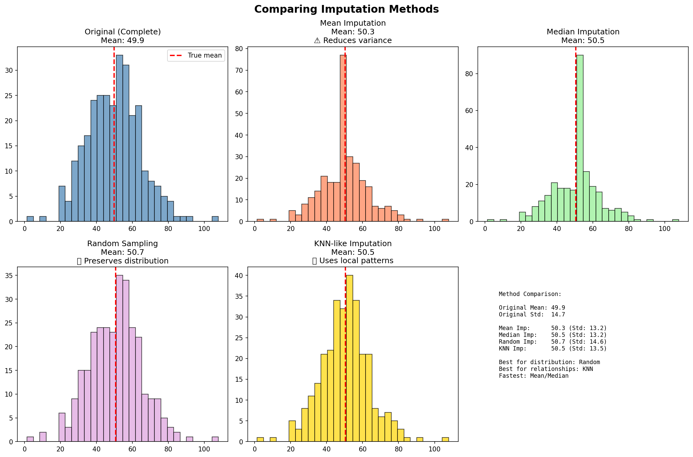

---

## Documenting EDA Findings

**Create a structured EDA report:**

```python
import pandas as pd
import matplotlib.pyplot as plt

def generate_eda_report(df, filename='eda_report.txt'):
    """Generate comprehensive EDA report"""
    
    with open(filename, 'w') as f:
        f.write("=" * 60 + "\n")
        f.write("EXPLORATORY DATA ANALYSIS REPORT\n")
        f.write("=" * 60 + "\n\n")
        
        # 1. Dataset Overview
        f.write("1. DATASET OVERVIEW\n")
        f.write("-" * 60 + "\n")
        f.write(f"Rows: {len(df):,}\n")
        f.write(f"Columns: {len(df.columns)}\n")
        f.write(f"Memory Usage: {df.memory_usage(deep=True).sum() / 1024**2:.2f} MB\n\n")
        
        # 2. Data Types
        f.write("2. DATA TYPES\n")
        f.write("-" * 60 + "\n")
        f.write(f"{df.dtypes.value_counts()}\n\n")
        
        # 3. Missing Data
        f.write("3. MISSING DATA\n")
        f.write("-" * 60 + "\n")
        missing = df.isnull().sum()
        missing_pct = (missing / len(df)) * 100
        missing_df = pd.DataFrame({
            'Missing_Count': missing[missing > 0],
            'Missing_Percentage': missing_pct[missing > 0]
        }).sort_values('Missing_Percentage', ascending=False)
        f.write(f"{missing_df.to_string()}\n\n")
        
        # 4. Numeric Variable Summary
        f.write("4. NUMERIC VARIABLES\n")
        f.write("-" * 60 + "\n")
        numeric_cols = df.select_dtypes(include=['number']).columns
        for col in numeric_cols:
            f.write(f"\n{col}:\n")
            f.write(f"  Mean: {df[col].mean():.2f}\n")
            f.write(f"  Median: {df[col].median():.2f}\n")
            f.write(f"  Std Dev: {df[col].std():.2f}\n")
            f.write(f"  Skewness: {df[col].skew():.2f}\n")
            f.write(f"  Range: [{df[col].min():.2f}, {df[col].max():.2f}]\n")
            
            # Outliers
            Q1 = df[col].quantile(0.25)
            Q3 = df[col].quantile(0.75)
            IQR = Q3 - Q1
            outliers = df[(df[col] < Q1 - 1.5*IQR) | (df[col] > Q3 + 1.5*IQR)]
            f.write(f"  Outliers: {len(outliers)} ({len(outliers)/len(df)*100:.1f}%)\n")
        
        # 5. Categorical Variable Summary
        f.write("\n5. CATEGORICAL VARIABLES\n")
        f.write("-" * 60 + "\n")
        cat_cols = df.select_dtypes(include=['object']).columns
        for col in cat_cols:
            f.write(f"\n{col}:\n")
            f.write(f"  Unique values: {df[col].nunique()}\n")
            f.write(f"  Most common: {df[col].mode()[0]} ({df[col].value_counts().iloc[0]})\n")
            f.write(f"  Top 5 categories:\n")
            for cat, count in df[col].value_counts().head().items():
                f.write(f"    {cat}: {count} ({count/len(df)*100:.1f}%)\n")
        
        # 6. Key Findings
        f.write("\n6. KEY FINDINGS\n")
        f.write("-" * 60 + "\n")
        f.write("TODO: Add manual observations:\n")
        f.write("  - Notable patterns:\n")
        f.write("  - Potential data quality issues:\n")
        f.write("  - Relationships discovered:\n")
        f.write("  - Recommended next steps:\n")
        
    print(f"EDA report saved to {filename}")

# Generate report
df = pd.read_csv('data.csv')
generate_eda_report(df)
```

**Best practice**: Always document your EDA findings for future reference!

---

## Correlation Analysis: Understanding Linear Relationships

**Correlation coefficient (Pearson's r):**
- Measures linear relationship strength
- Range: -1 (perfect negative) to +1 (perfect positive)
- 0 = no linear relationship

**Interpretation guidelines:**
- |r| > 0.7: Strong relationship
- 0.4 < |r| < 0.7: Moderate relationship
- 0.2 < |r| < 0.4: Weak relationship
- |r| < 0.2: Very weak/no relationship

**⚠️ Important warnings:**
- Correlation ≠ Causation
- Only measures LINEAR relationships
- Sensitive to outliers
- Can be misleading with non-linear patterns

```python
import pandas as pd
import numpy as np

# Calculate correlation matrix
df = pd.read_csv('data.csv')
corr_matrix = df.corr()

print("Correlation Matrix:")
print(corr_matrix)

# Find highly correlated pairs
threshold = 0.7
high_corr = []
for i in range(len(corr_matrix.columns)):
    for j in range(i+1, len(corr_matrix.columns)):
        if abs(corr_matrix.iloc[i, j]) > threshold:
            high_corr.append((corr_matrix.columns[i], 
                             corr_matrix.columns[j], 
                             corr_matrix.iloc[i, j]))

print(f"\nHigh correlations (|r| > {threshold}):")
for var1, var2, corr in high_corr:
    print(f"{var1} <-> {var2}: r = {corr:.3f}")
```

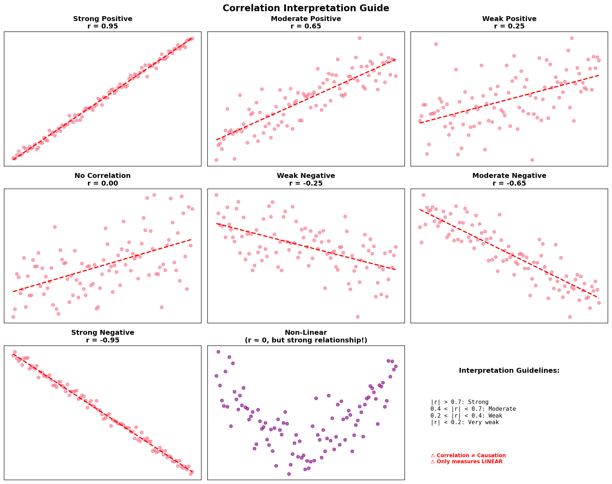

---

## Correlation Heatmaps: Visualizing All Relationships

**Heatmap best practices:**

```python
import pandas as pd
import matplotlib.pyplot as plt
import seaborn as sns
import numpy as np

# Load data
df = pd.read_csv('sales_data.csv')

# Select numeric columns only
numeric_cols = df.select_dtypes(include=[np.number]).columns
df_numeric = df[numeric_cols]

fig, axes = plt.subplots(1, 3, figsize=(18, 5))

# 1. Basic heatmap
sns.heatmap(df_numeric.corr(), annot=True, fmt='.2f', 
            cmap='coolwarm', center=0, ax=axes[0])
axes[0].set_title('Basic Correlation Heatmap')

# 2. Mask upper triangle (avoid redundancy)
mask = np.triu(np.ones_like(df_numeric.corr(), dtype=bool))
sns.heatmap(df_numeric.corr(), mask=mask, annot=True, fmt='.2f',
            cmap='coolwarm', center=0, square=True, ax=axes[1])
axes[1].set_title('Lower Triangle Only\n(Removes redundancy)')

# 3. Only show strong correlations (|r| > 0.5)
corr = df_numeric.corr()
corr_filtered = corr.copy()
corr_filtered[abs(corr) < 0.5] = 0
sns.heatmap(corr_filtered, annot=True, fmt='.2f',
            cmap='coolwarm', center=0, ax=axes[2])
axes[2].set_title('Strong Correlations Only\n(|r| > 0.5)')

plt.tight_layout()
plt.show()
```

**Design tips:**
- Use diverging colormap (e.g., coolwarm, RdBu)
- Center at 0 for correlation
- Show values with annotations
- Consider masking redundant half

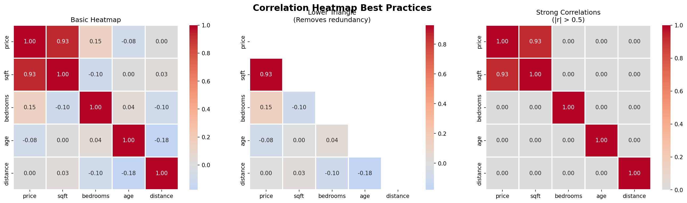

---

## Anscombe's Quartet: Why Visualization Matters

**Famous example showing why you MUST visualize, not just calculate statistics**

All four datasets have:
- Same mean of x and y
- Same variance
- Same correlation (r = 0.816)
- Same regression line

**But completely different patterns!**

```python
import matplotlib.pyplot as plt
import seaborn as sns

# Anscombe's quartet (built into seaborn)
anscombe = sns.load_dataset("anscombe")

# Create 2x2 grid
g = sns.FacetGrid(anscombe, col="dataset", col_wrap=2, height=4)
g.map_dataframe(sns.scatterplot, x="x", y="y", s=100)
g.map_dataframe(sns.regplot, x="x", y="y", scatter=False, color='red')

# Add titles showing statistics
for ax, dataset in zip(g.axes.flat, ['I', 'II', 'III', 'IV']):
    data = anscombe[anscombe['dataset'] == dataset]
    corr = data['x'].corr(data['y'])
    ax.set_title(f'Dataset {dataset}\nr = {corr:.3f}')

plt.tight_layout()
plt.show()
```

**Lesson**: Always plot your data! Statistics alone can be misleading.

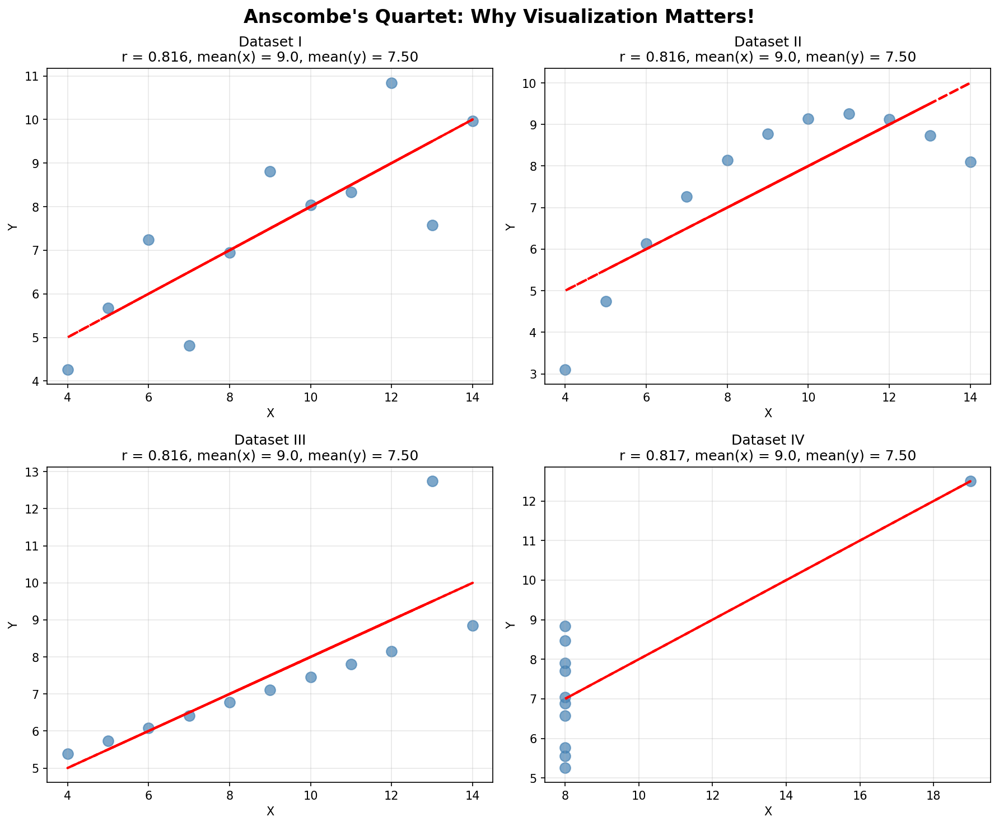

---

## Pair Plots: Exploring All Relationships

**Pair plot (scatterplot matrix):**
- Shows all pairwise relationships
- Diagonal: distribution of each variable
- Off-diagonal: scatter plots

```python
import seaborn as sns
import matplotlib.pyplot as plt

# Load data
df = pd.read_csv('data.csv')

# Select subset of numeric variables (too many makes it unreadable)
numeric_vars = ['price', 'sqft', 'bedrooms', 'age', 'distance_to_city']
df_subset = df[numeric_vars]

# Create pair plot
sns.pairplot(df_subset, diag_kind='kde', plot_kws={'alpha': 0.6})
plt.suptitle('Pair Plot: All Pairwise Relationships', y=1.02)
plt.tight_layout()
plt.show()

# With color-coding by category
sns.pairplot(df_subset, hue='property_type', diag_kind='kde', 
             plot_kws={'alpha': 0.6})
plt.suptitle('Pair Plot: Color-Coded by Property Type', y=1.02)
plt.tight_layout()
plt.show()
```

**When to use:**
- ✅ 3-8 variables (readable)
- ✅ Want to see all relationships at once
- ✅ Looking for patterns and outliers
- ❌ Too many variables (>10) becomes cluttered

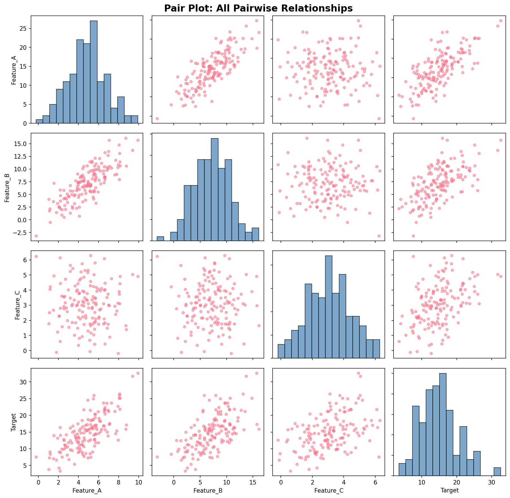

---

## Multivariate Visualization: Beyond Two Variables

**Techniques for showing 3+ variables:**

```python
import matplotlib.pyplot as plt
import seaborn as sns
import pandas as pd

# Load data
df = pd.read_csv('housing.csv')

fig, axes = plt.subplots(2, 2, figsize=(14, 12))

# 1. Color encoding (3rd variable)
scatter = axes[0, 0].scatter(df['sqft'], df['price'], 
                              c=df['age'], cmap='viridis', 
                              s=50, alpha=0.6)
axes[0, 0].set_xlabel('Square Feet')
axes[0, 0].set_ylabel('Price ($)')
axes[0, 0].set_title('Color = Age')
plt.colorbar(scatter, ax=axes[0, 0], label='Age (years)')

# 2. Size encoding (4th variable!)
scatter = axes[0, 1].scatter(df['sqft'], df['price'],
                              c=df['age'], cmap='viridis',
                              s=df['bedrooms']*20, alpha=0.6)
axes[0, 1].set_xlabel('Square Feet')
axes[0, 1].set_ylabel('Price ($)')
axes[0, 1].set_title('Color = Age, Size = Bedrooms')
plt.colorbar(scatter, ax=axes[0, 1], label='Age (years)')

# 3. Faceting/small multiples (split by category)
for i, location in enumerate(df['location'].unique()[:4]):
    row = i // 2
    col = i % 2
    if row == 1:
        subset = df[df['location'] == location]
        axes[row, col].scatter(subset['sqft'], subset['price'], alpha=0.6)
        axes[row, col].set_xlabel('Square Feet')
        axes[row, col].set_ylabel('Price ($)')
        axes[row, col].set_title(f'Location: {location}')

plt.tight_layout()
plt.show()
```

**Encoding options:**
- Position (x, y) - 2 variables
- Color - 1 variable (categorical or continuous)
- Size - 1 variable (usually continuous)
- Shape - 1 variable (categorical, max 5-6 categories)
- Facets - 1-2 variables (categorical)

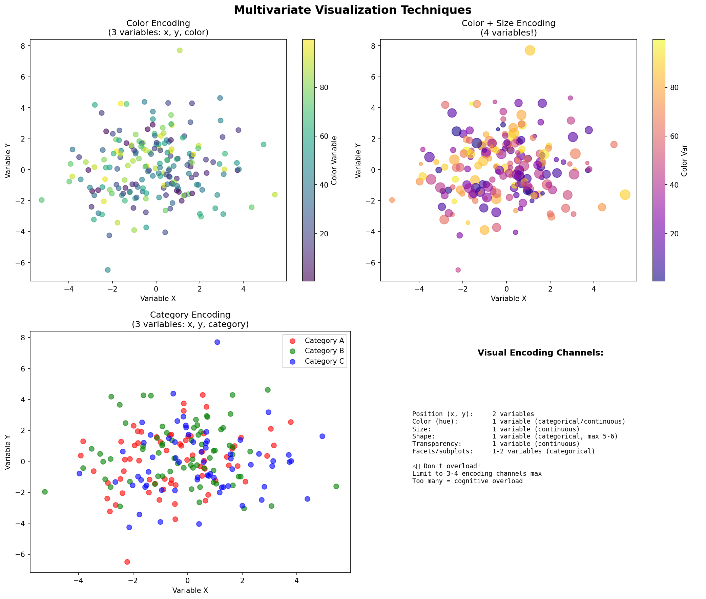

---

## Bivariate Analysis: Exploring Relationships

**Goal**: Understand how two variables relate to each other

**Types of bivariate relationships:**

1. **Numeric vs. Numeric**
   - Questions: Linear? Non-linear? Strength? Direction?
   - Tools: Scatter plot, regression line, correlation

2. **Numeric vs. Categorical**
   - Questions: Do groups differ? How much? Which group is highest?
   - Tools: Box plots, violin plots, strip plots

3. **Categorical vs. Categorical**
   - Questions: Are categories independent? Any associations?
   - Tools: Stacked bars, grouped bars, heatmap

4. **Numeric vs. Time**
   - Questions: Trend? Seasonality? Cycles? Anomalies?
   - Tools: Line chart, area chart

**Key principle**: Different variable types require different visualizations

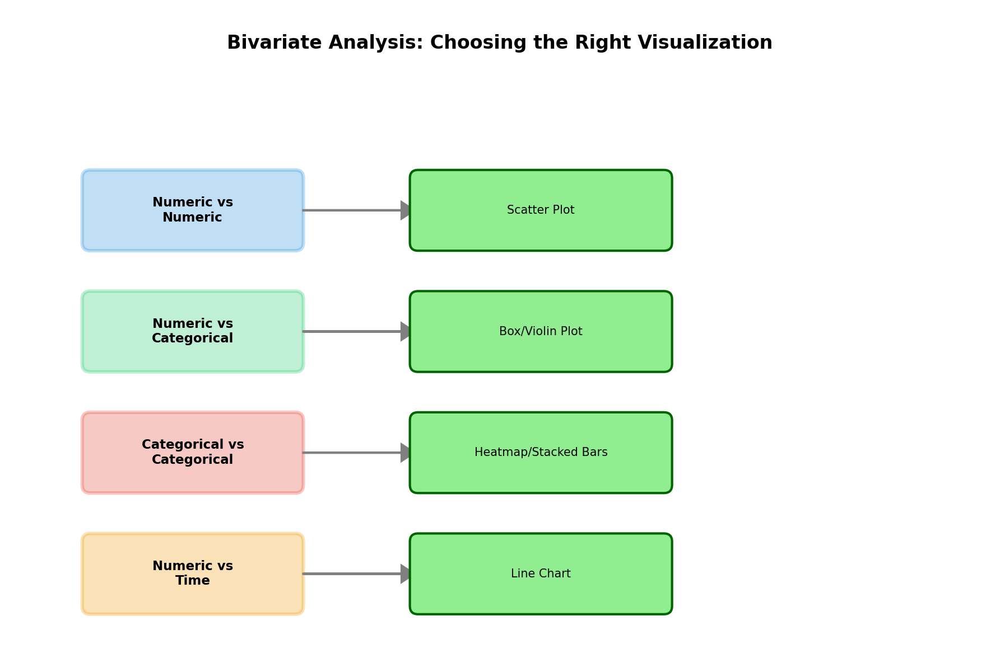

---

## Numeric vs. Numeric: Scatter Plots

**Scatter plots reveal:**
- Direction of relationship (positive, negative, none)
- Strength of relationship (tight cluster vs. dispersed)
- Shape of relationship (linear, polynomial, exponential)
- Outliers and influential points
- Groups or clusters

```python
import pandas as pd
import matplotlib.pyplot as plt
import seaborn as sns
import numpy as np

# Load data
df = pd.read_csv('housing.csv')

fig, axes = plt.subplots(2, 2, figsize=(14, 12))

# 1. Basic scatter plot
axes[0, 0].scatter(df['sqft'], df['price'], alpha=0.5)
axes[0, 0].set_xlabel('Square Feet')
axes[0, 0].set_ylabel('Price ($)')
axes[0, 0].set_title('Basic Scatter Plot')

# 2. With regression line
sns.regplot(x='sqft', y='price', data=df, ax=axes[0, 1], 
            scatter_kws={'alpha': 0.5})
axes[0, 1].set_title('With Regression Line')

# 3. Color-coded by third variable
scatter = axes[1, 0].scatter(df['sqft'], df['price'], 
                              c=df['bedrooms'], cmap='viridis', alpha=0.6)
axes[1, 0].set_xlabel('Square Feet')
axes[1, 0].set_ylabel('Price ($)')
axes[1, 0].set_title('Color-Coded by Bedrooms')
plt.colorbar(scatter, ax=axes[1, 0], label='Bedrooms')

# 4. With marginal distributions
from scipy import stats
axes[1, 1].scatter(df['sqft'], df['price'], alpha=0.5)
axes[1, 1].set_xlabel('Square Feet')
axes[1, 1].set_ylabel('Price ($)')
# Calculate correlation
corr = df['sqft'].corr(df['price'])
axes[1, 1].set_title(f'Correlation: r = {corr:.3f}')
# Add trend line
z = np.polyfit(df['sqft'], df['price'], 1)
p = np.poly1d(z)
axes[1, 1].plot(df['sqft'], p(df['sqft']), "r--", alpha=0.8, linewidth=2)

plt.tight_layout()
plt.show()
```

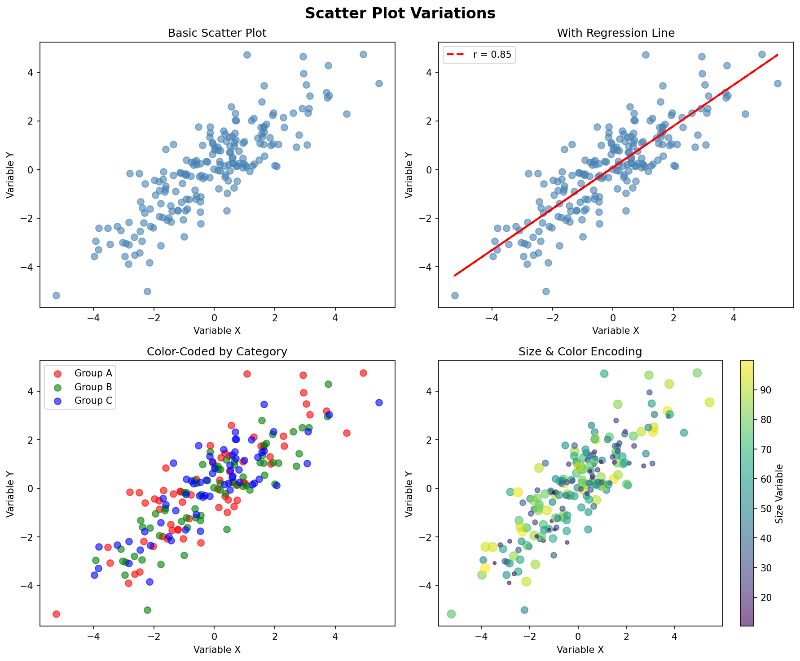

---

## Dealing with Overplotting

**Problem**: When many points overlap, patterns become invisible

**Solutions:**

```python
import pandas as pd
import matplotlib.pyplot as plt
import seaborn as sns

# Generate overlapping data
np.random.seed(42)
n = 10000
df = pd.DataFrame({
    'x': np.random.randn(n),
    'y': np.random.randn(n) * 0.5 + np.random.randn(n)
})

fig, axes = plt.subplots(2, 3, figsize=(15, 10))

# 1. Problem: Regular scatter (can't see density)
axes[0, 0].scatter(df['x'], df['y'])
axes[0, 0].set_title('❌ Overplotted\n(Cannot see density)')

# 2. Solution 1: Alpha transparency
axes[0, 1].scatter(df['x'], df['y'], alpha=0.1)
axes[0, 1].set_title('✅ Alpha Transparency\n(Shows density)')

# 3. Solution 2: Smaller points
axes[0, 2].scatter(df['x'], df['y'], s=1, alpha=0.5)
axes[0, 2].set_title('✅ Smaller Points')

# 4. Solution 3: 2D histogram (hexbin)
axes[1, 0].hexbin(df['x'], df['y'], gridsize=30, cmap='Blues')
axes[1, 0].set_title('✅ Hexbin (Shows density)')

# 5. Solution 4: 2D density contour
sns.kdeplot(x=df['x'], y=df['y'], ax=axes[1, 1], fill=True, cmap='Blues')
axes[1, 1].set_title('✅ 2D KDE (Smoothed density)')

# 6. Solution 5: Sample the data
sample = df.sample(1000)
axes[1, 2].scatter(sample['x'], sample['y'], alpha=0.5)
axes[1, 2].set_title(f'✅ Random Sample\n({len(sample)} of {len(df)} points)')

plt.tight_layout()
plt.show()
```

**Rule of thumb**: If n > 1000, consider using transparency, hexbins, or sampling

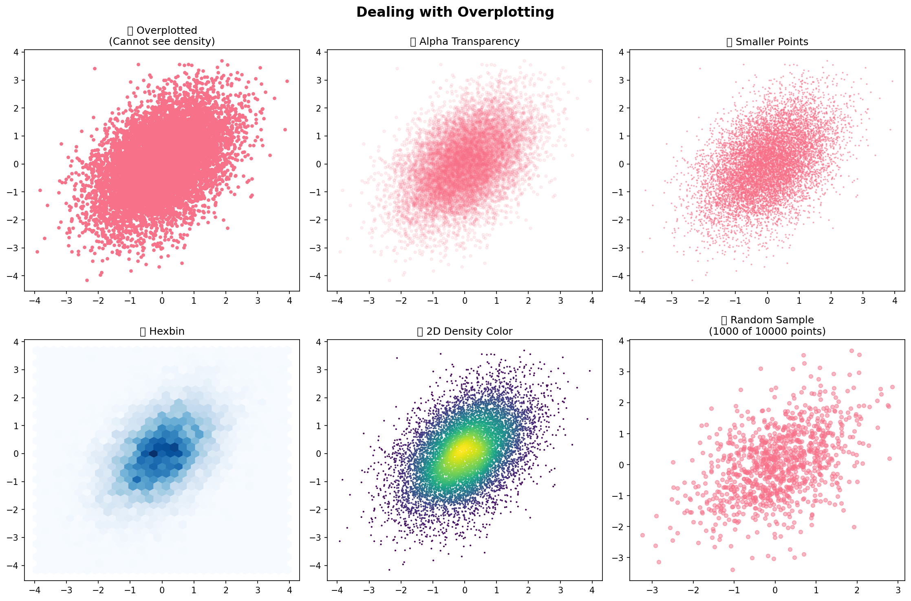

---

## Numeric vs. Categorical: Comparing Groups

**Goal**: Compare distributions across groups

```python
import pandas as pd
import matplotlib.pyplot as plt
import seaborn as sns

# Load data
df = pd.read_csv('employees.csv')

fig, axes = plt.subplots(2, 3, figsize=(15, 10))

# 1. Side-by-side box plots
sns.boxplot(x='department', y='salary', data=df, ax=axes[0, 0])
axes[0, 0].set_title('Box Plots')
axes[0, 0].tick_params(axis='x', rotation=45)

# 2. Violin plots (shows distribution shape)
sns.violinplot(x='department', y='salary', data=df, ax=axes[0, 1])
axes[0, 1].set_title('Violin Plots\n(Shows distribution shape)')
axes[0, 1].tick_params(axis='x', rotation=45)

# 3. Strip plot (shows individual points)
sns.stripplot(x='department', y='salary', data=df, alpha=0.5, ax=axes[0, 2])
axes[0, 2].set_title('Strip Plot\n(Shows all points)')
axes[0, 2].tick_params(axis='x', rotation=45)

# 4. Swarm plot (no overlap)
if len(df) < 1000:  # Only for smaller datasets
    sns.swarmplot(x='department', y='salary', data=df, ax=axes[1, 0])
    axes[1, 0].set_title('Swarm Plot\n(No overlap)')
    axes[1, 0].tick_params(axis='x', rotation=45)
else:
    axes[1, 0].text(0.5, 0.5, 'Too many points\nfor swarm plot', 
                    ha='center', va='center', transform=axes[1, 0].transAxes)

# 5. Overlapping violin + strip
sns.violinplot(x='department', y='salary', data=df, inner=None, ax=axes[1, 1])
sns.stripplot(x='department', y='salary', data=df, color='black', 
              alpha=0.3, size=2, ax=axes[1, 1])
axes[1, 1].set_title('Violin + Strip\n(Best of both)')
axes[1, 1].tick_params(axis='x', rotation=45)

# 6. Histogram overlay
for dept in df['department'].unique():
    data = df[df['department'] == dept]['salary']
    axes[1, 2].hist(data, alpha=0.5, label=dept, bins=20)
axes[1, 2].set_xlabel('Salary')
axes[1, 2].set_ylabel('Count')
axes[1, 2].set_title('Overlapping Histograms')
axes[1, 2].legend()

plt.tight_layout()
plt.show()
```

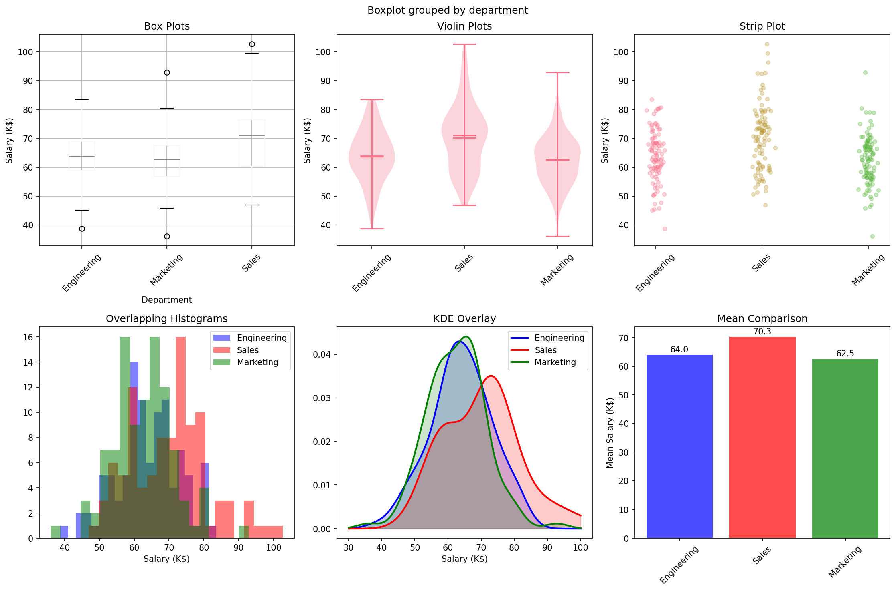

---

## Categorical vs. Categorical: Cross-Tabulation

**Goal**: Understand associations between categorical variables

```python
import pandas as pd
import matplotlib.pyplot as plt
import seaborn as sns

# Load data
df = pd.read_csv('customers.csv')

# Create cross-tabulation
crosstab = pd.crosstab(df['product_category'], df['customer_segment'])
print("Frequency Table:")
print(crosstab)
print("\nProportions (by row):")
print(pd.crosstab(df['product_category'], df['customer_segment'], normalize='index'))

fig, axes = plt.subplots(2, 2, figsize=(14, 12))

# 1. Grouped bar chart
crosstab.plot(kind='bar', ax=axes[0, 0])
axes[0, 0].set_title('Grouped Bar Chart\n(Absolute counts)')
axes[0, 0].set_xlabel('Product Category')
axes[0, 0].set_ylabel('Count')
axes[0, 0].legend(title='Customer Segment')
axes[0, 0].tick_params(axis='x', rotation=45)

# 2. Stacked bar chart
crosstab.plot(kind='bar', stacked=True, ax=axes[0, 1])
axes[0, 1].set_title('Stacked Bar Chart\n(Shows composition)')
axes[0, 1].set_xlabel('Product Category')
axes[0, 1].set_ylabel('Count')
axes[0, 1].legend(title='Customer Segment')
axes[0, 1].tick_params(axis='x', rotation=45)

# 3. Heatmap (proportions)
crosstab_pct = pd.crosstab(df['product_category'], df['customer_segment'], normalize='index')
sns.heatmap(crosstab_pct, annot=True, fmt='.2%', cmap='YlOrRd', ax=axes[1, 0])
axes[1, 0].set_title('Heatmap\n(Proportions by row)')
axes[1, 0].set_xlabel('Customer Segment')
axes[1, 0].set_ylabel('Product Category')

# 4. Mosaic-style (proportional bars)
crosstab_norm = crosstab.div(crosstab.sum(axis=1), axis=0)
crosstab_norm.plot(kind='barh', stacked=True, ax=axes[1, 1])
axes[1, 1].set_title('Normalized Stacked Bars\n(100% stacked)')
axes[1, 1].set_xlabel('Proportion')
axes[1, 1].set_ylabel('Product Category')
axes[1, 1].legend(title='Customer Segment', bbox_to_anchor=(1.05, 1))

plt.tight_layout()
plt.show()
```

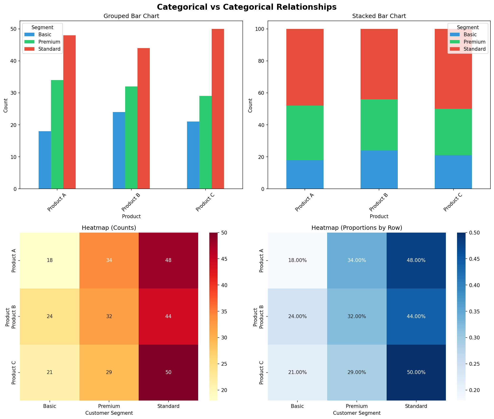

---

## Learning Objectives

**By the end of this class, you will be able to:**
- Understand the role of EDA in the data science workflow
- Choose appropriate visualizations for different exploratory tasks
- Detect data quality issues visually
- Identify patterns, outliers, and relationships in data
- Build a systematic EDA workflow in Python
- Translate visual findings into modeling decisions

**Prerequisites**: Class 3 (Visual Perception, Grammar of Graphics, Python visualization basics)

---

## What is Exploratory Data Analysis (EDA)?

**Definition**: EDA is an approach to analyzing datasets to summarize their main characteristics, often using visual methods.

**EDA is NOT**:
- ❌ Just making pretty charts
- ❌ Confirmatory analysis (testing specific hypotheses)
- ❌ Final presentation visualizations
- ❌ Automated profiling reports (though useful as starting points)

**EDA IS**:
- ✅ **Detective work** - searching for clues in data
- ✅ **Iterative** - asking questions, finding answers, asking new questions
- ✅ **Visual-first** - seeing patterns before computing statistics
- ✅ **Hypothesis-generating** - discovering what to test formally

> "The greatest value of a picture is when it forces us to notice what we never expected to see." — John Tukey (pioneer of EDA)

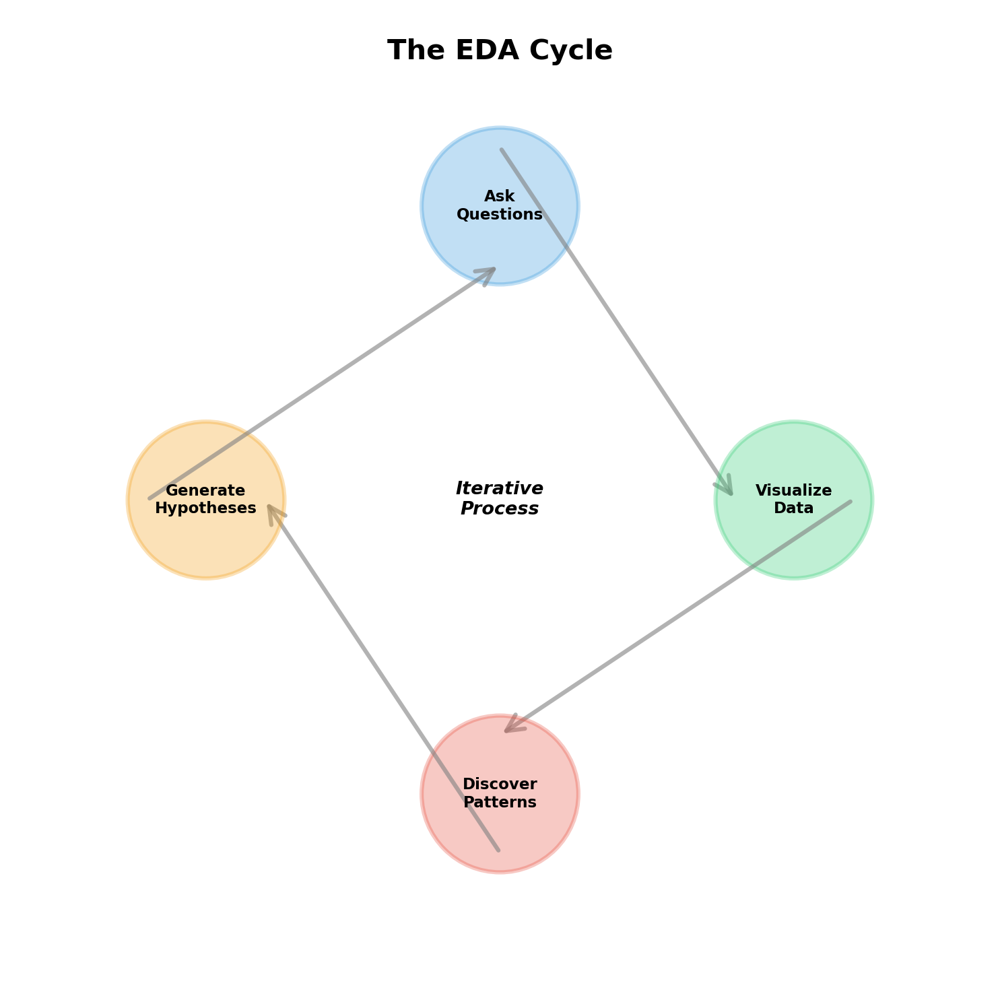

---

## EDA in the Data Science Lifecycle

**Where EDA fits:**

```
Data Collection → Data Cleaning → EDA → Feature Engineering → Modeling → Evaluation → Deployment
                       ↑______________|      ↑___________________|
                     (EDA informs         (EDA guides
                      cleaning)            features)
```

**Why EDA matters:**
1. **Before cleaning**: Understand what needs fixing
2. **During cleaning**: Validate cleaning decisions
3. **Before modeling**: Understand relationships and distributions
4. **During feature engineering**: Discover transformation needs
5. **After initial modeling**: Diagnose model failures

**Impact**: Good EDA can save weeks of failed modeling attempts

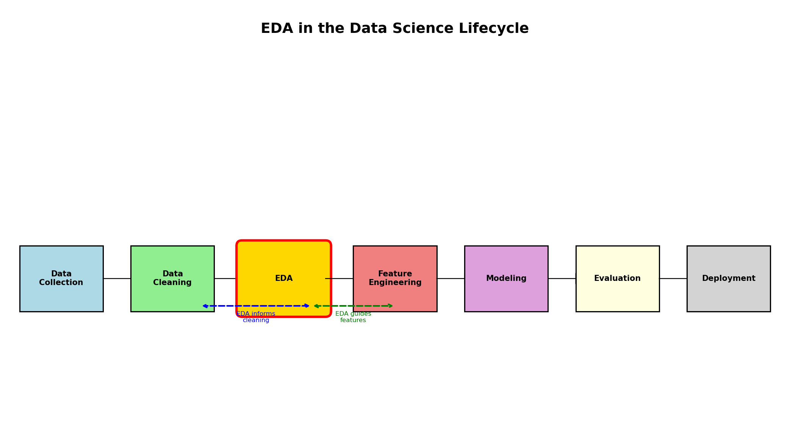

---

## The EDA Mindset: Questions Over Answers

**The EDA process is question-driven:**

**Phase 1: Understanding Data Structure**
- What variables do I have?
- What are their types and scales?
- How much data is there?
- What's missing or unusual?

**Phase 2: Understanding Distributions**
- What does a typical value look like?
- What's the range and spread?
- Are there outliers or extreme values?
- Is the distribution skewed or symmetric?

**Phase 3: Understanding Relationships**
- How do variables relate to each other?
- Are there groups or clusters?
- What correlates with the target variable?
- Are there interaction effects?

**Phase 4: Generating Hypotheses**
- What patterns need explanation?
- What should be tested formally?
- What features might be useful?
- What modeling approaches seem appropriate?

---

## Common EDA Tasks & Their Visualizations

**Match your question to the right visualization:**

| **Task** | **Question** | **Best Visualization** |
|----------|-------------|------------------------|
| **Distribution** | What's the shape of this variable? | Histogram, KDE, Box plot, Violin plot |
| **Comparison** | How do groups differ? | Side-by-side box plots, Grouped bars |
| **Relationship** | How do two variables relate? | Scatter plot, Line plot, Hex bins |
| **Composition** | What are the parts of the whole? | Stacked bars, Area chart |
| **Ranking** | What are the top/bottom items? | Horizontal bar chart, Lollipop chart |
| **Deviation** | How does this differ from normal? | Bar chart with reference line |
| **Correlation** | Which variables move together? | Heatmap, Pair plot |
| **Time** | How does this change over time? | Line chart, Area chart |

**Key principle**: Choose the visualization that makes your specific question easiest to answer.

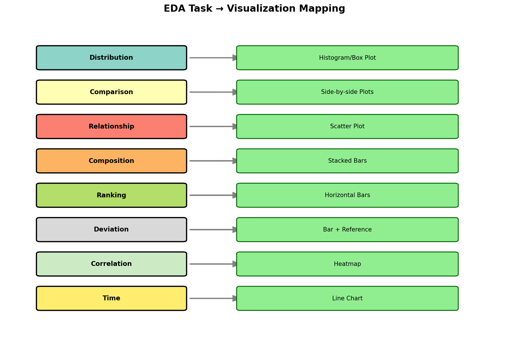

---

## Data Quality: The Hidden First Step

**You can't explore data you don't understand or trust**

**Common data quality issues EDA reveals:**

1. **Missing values** (nulls, NaN, placeholders like -999)
2. **Duplicates** (exact or near-duplicates)
3. **Inconsistencies** (mixed formats, typos, contradictions)
4. **Outliers** (legitimate extremes vs. errors)
5. **Skewed distributions** (need transformation)
6. **Imbalanced classes** (majority class dominance)
7. **Data leakage** (future information in training data)
8. **Encoding issues** (wrong data types, categories as numbers)

**EDA strategy**: Visualize quality issues before analyzing relationships

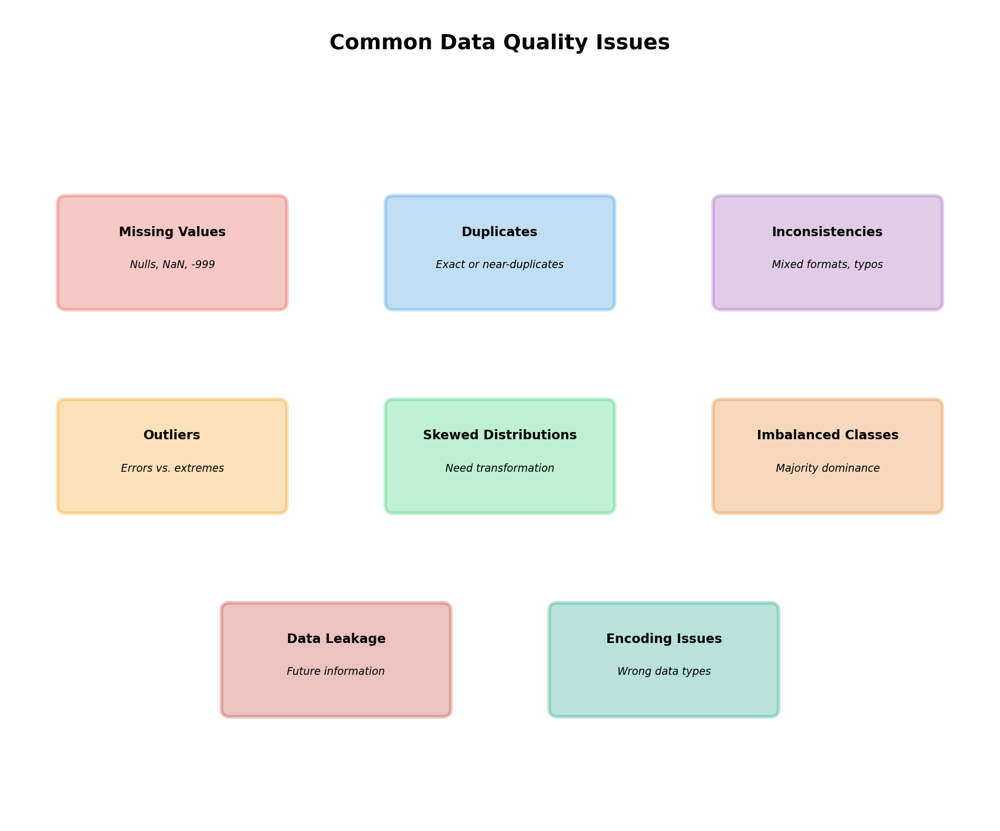

---

## Visual Data Quality Checks

**Quick visual diagnostics:**

```python
import pandas as pd
import matplotlib.pyplot as plt
import seaborn as sns

# Load data
df = pd.read_csv('data.csv')

# 1. Overview: What do we have?
print(df.info())
print(df.describe())

# 2. Missing data pattern
plt.figure(figsize=(10, 6))
sns.heatmap(df.isnull(), cbar=False, yticklabels=False)
plt.title('Missing Data Pattern')
plt.show()

# 3. Check for duplicates
print(f"Duplicate rows: {df.duplicated().sum()}")

# 4. Value distributions
df.hist(figsize=(12, 10), bins=30)
plt.tight_layout()
plt.show()
```

**What to look for:**
- ✅ Patterns in missingness (structured missing data)
- ✅ Unexpected spikes in histograms
- ✅ Impossible values (negative ages, dates in future)
- ✅ Too many identical values (stuck sensors, defaults)

---

## Understanding Distributions: Shape Matters

**Distribution shape tells you about:**
- Central tendency (where most values are)
- Spread (variability)
- Skewness (asymmetry)
- Outliers (extreme values)
- Modality (multiple peaks)

**Common distribution shapes:**

1. **Normal (Gaussian)**: Symmetric bell curve
   - Many natural phenomena
   - Good for parametric tests
   
2. **Skewed**: Long tail on one side
   - Right-skewed: income, house prices
   - Left-skewed: age at retirement
   
3. **Bimodal**: Two peaks
   - Suggests two subpopulations
   - Example: customer purchases (high vs low spenders)
   
4. **Uniform**: Flat distribution
   - All values equally likely
   - Example: random number generator
   
5. **Long-tailed**: Heavy tails, many outliers
   - Power law distributions
   - Example: social media engagement

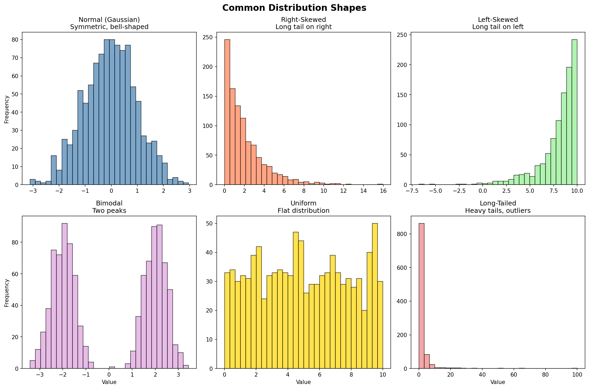

---

## Choosing the Right Distribution Visualization

**Each visualization highlights different aspects:**

**Histogram**
- ✅ Shows shape and modality clearly
- ✅ Good for large datasets
- ⚠️ Sensitive to bin width choice
- ❌ Hides individual data points

**KDE (Kernel Density Estimate)**
- ✅ Smooth curve shows shape
- ✅ Not affected by bin choice
- ⚠️ Can over-smooth and hide details
- ❌ Can show impossible values (negative when data is positive)

**Box Plot**
- ✅ Shows median, quartiles, outliers
- ✅ Great for comparing groups
- ✅ Compact representation
- ❌ Hides distribution shape (bimodal looks unimodal)

**Violin Plot**
- ✅ Combines box plot + KDE
- ✅ Shows both summary stats and shape
- ✅ Excellent for group comparisons
- ⚠️ Requires more space

**ECDF (Empirical Cumulative Distribution)**
- ✅ Shows exact percentiles
- ✅ No binning decisions needed
- ✅ Great for comparing distributions
- ⚠️ Less intuitive for most audiences

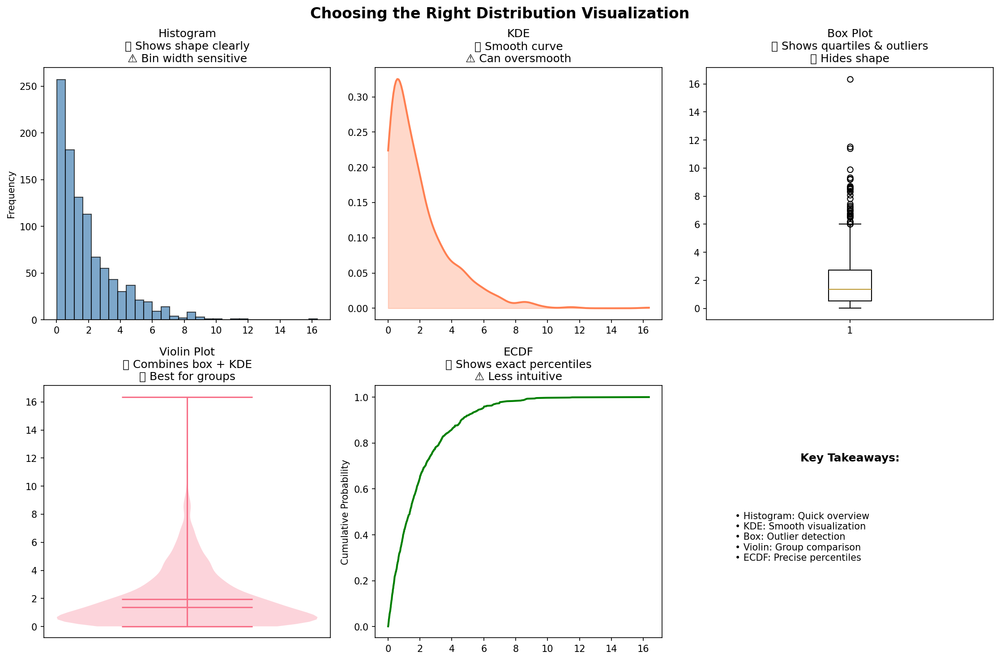

---

## Univariate Analysis: Single Variable Exploration

**Goal**: Understand each variable individually before looking at relationships

**Key questions for numeric variables:**
- What's the central tendency? (mean, median, mode)
- What's the spread? (range, IQR, standard deviation)
- What's the shape? (skew, kurtosis, modality)
- Are there outliers?
- Are there gaps or unusual patterns?

**Key questions for categorical variables:**
- How many unique categories?
- What's the frequency distribution?
- Are categories balanced or imbalanced?
- Are there rare categories?
- Are there suspicious categories? (typos, encoding issues)

**Strategy**: Start simple (summary stats), then visualize, then investigate anomalies

---

## Univariate EDA: Numeric Variables in Python

**Complete workflow for a numeric variable:**

```python
import pandas as pd
import matplotlib.pyplot as plt
import seaborn as sns
import numpy as np

# Load data
df = pd.read_csv('housing.csv')
price = df['price']

# 1. Basic statistics
print(f"Count: {price.count()}")
print(f"Mean: ${price.mean():,.2f}")
print(f"Median: ${price.median():,.2f}")
print(f"Std Dev: ${price.std():,.2f}")
print(f"Min: ${price.min():,.2f}")
print(f"Max: ${price.max():,.2f}")
print(f"Skewness: {price.skew():.2f}")

# 2. Create comprehensive visualization
fig, axes = plt.subplots(2, 2, figsize=(12, 10))

# Histogram
axes[0, 0].hist(price, bins=50, edgecolor='black', alpha=0.7)
axes[0, 0].axvline(price.mean(), color='red', linestyle='--', label='Mean')
axes[0, 0].axvline(price.median(), color='green', linestyle='--', label='Median')
axes[0, 0].set_title('Distribution: Histogram')
axes[0, 0].set_xlabel('Price ($)')
axes[0, 0].legend()

# Box plot
axes[0, 1].boxplot(price, vert=True)
axes[0, 1].set_title('Distribution: Box Plot')
axes[0, 1].set_ylabel('Price ($)')

# KDE
sns.kdeplot(price, ax=axes[1, 0], fill=True)
axes[1, 0].set_title('Distribution: KDE')
axes[1, 0].set_xlabel('Price ($)')

# QQ plot for normality
from scipy import stats
stats.probplot(price, dist="norm", plot=axes[1, 1])
axes[1, 1].set_title('Q-Q Plot (Normality Check)')

plt.tight_layout()
plt.show()
```


---

## Detecting and Handling Skewness

**Skewness matters because:**
- Many models assume normal distributions
- Skewed data can have extreme outliers
- Relationships may be non-linear on original scale

**Visual detection:**
- Histogram/KDE: Long tail on one side
- Box plot: Many outliers on one side
- Mean ≠ Median (mean pulled by tail)

**Common transformations for right-skewed data:**

```python
import numpy as np
import matplotlib.pyplot as plt

# Original skewed data
data = df['income']  # Right-skewed

fig, axes = plt.subplots(2, 2, figsize=(12, 8))

# Original
axes[0, 0].hist(data, bins=50, edgecolor='black')
axes[0, 0].set_title(f'Original (Skew: {data.skew():.2f})')

# Log transformation
axes[0, 1].hist(np.log(data + 1), bins=50, edgecolor='black')
axes[0, 1].set_title(f'Log (Skew: {np.log(data + 1).skew():.2f})')

# Square root transformation
axes[1, 0].hist(np.sqrt(data), bins=50, edgecolor='black')
axes[1, 0].set_title(f'Square Root (Skew: {np.sqrt(data).skew():.2f})')

# Box-Cox transformation
from scipy import stats
transformed, lambda_param = stats.boxcox(data + 1)
axes[1, 1].hist(transformed, bins=50, edgecolor='black')
axes[1, 1].set_title(f'Box-Cox (λ={lambda_param:.2f})')

plt.tight_layout()
plt.show()
```

**Rule of thumb**: If |skew| > 1, consider transformation

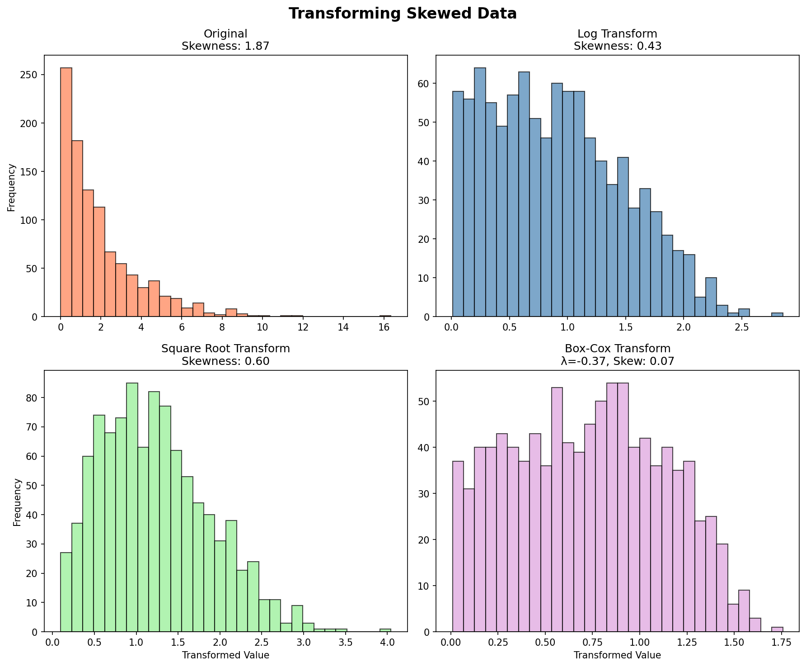

---

## Univariate EDA: Categorical Variables in Python

**Complete workflow for a categorical variable:**

```python
import pandas as pd
import matplotlib.pyplot as plt
import seaborn as sns

# Load data
df = pd.read_csv('customers.csv')
category = df['customer_segment']

# 1. Basic statistics
print(f"Unique categories: {category.nunique()}")
print(f"Most common: {category.mode()[0]}")
print(f"Missing values: {category.isnull().sum()}")
print("\nFrequency table:")
print(category.value_counts())
print("\nProportions:")
print(category.value_counts(normalize=True))

# 2. Visualizations
fig, axes = plt.subplots(1, 3, figsize=(15, 5))

# Count plot (vertical bars)
sns.countplot(y=category, order=category.value_counts().index, ax=axes[0])
axes[0].set_title('Distribution: Count Plot')
axes[0].set_xlabel('Count')

# Pie chart (only if few categories)
if category.nunique() <= 5:
    category.value_counts().plot(kind='pie', ax=axes[1], autopct='%1.1f%%')
    axes[1].set_ylabel('')
    axes[1].set_title('Distribution: Pie Chart')
else:
    axes[1].text(0.5, 0.5, 'Too many categories\nfor pie chart', 
                 ha='center', va='center')
    axes[1].axis('off')

# Bar chart (horizontal) with percentages
counts = category.value_counts()
percentages = counts / counts.sum() * 100
axes[2].barh(range(len(counts)), percentages)
axes[2].set_yticks(range(len(counts)))
axes[2].set_yticklabels(counts.index)
axes[2].set_xlabel('Percentage (%)')
axes[2].set_title('Distribution: Percentage')

# Add value labels
for i, v in enumerate(percentages):
    axes[2].text(v + 1, i, f'{v:.1f}%', va='center')

plt.tight_layout()
plt.show()
```

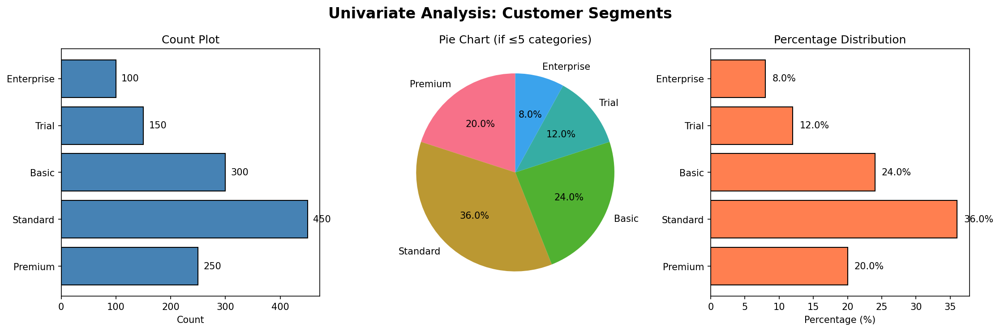

---

## Identifying Outliers Visually

**Multiple perspectives on outliers:**

```python
import pandas as pd
import matplotlib.pyplot as plt
import seaborn as sns
import numpy as np

data = df['transaction_amount']

fig, axes = plt.subplots(2, 3, figsize=(15, 10))

# 1. Box plot (IQR method)
axes[0, 0].boxplot(data)
axes[0, 0].set_title('Box Plot\n(IQR: Q1-1.5*IQR, Q3+1.5*IQR)')
axes[0, 0].set_ylabel('Amount ($)')

# 2. Histogram with outlier threshold
Q1 = data.quantile(0.25)
Q3 = data.quantile(0.75)
IQR = Q3 - Q1
lower_bound = Q1 - 1.5 * IQR
upper_bound = Q3 + 1.5 * IQR

axes[0, 1].hist(data, bins=50, alpha=0.7)
axes[0, 1].axvline(lower_bound, color='red', linestyle='--', label='Lower bound')
axes[0, 1].axvline(upper_bound, color='red', linestyle='--', label='Upper bound')
axes[0, 1].set_title('Histogram with IQR Bounds')
axes[0, 1].legend()

# 3. Z-score method
z_scores = np.abs((data - data.mean()) / data.std())
axes[0, 2].scatter(range(len(data)), z_scores, alpha=0.5)
axes[0, 2].axhline(3, color='red', linestyle='--', label='|z| = 3')
axes[0, 2].set_title('Z-Score Method')
axes[0, 2].set_ylabel('|Z-score|')
axes[0, 2].legend()

# 4. Percentile method
axes[1, 0].hist(data, bins=50, alpha=0.7)
p1 = data.quantile(0.01)
p99 = data.quantile(0.99)
axes[1, 0].axvline(p1, color='red', linestyle='--', label='1st percentile')
axes[1, 0].axvline(p99, color='red', linestyle='--', label='99th percentile')
axes[1, 0].set_title('Percentile Method (1%, 99%)')
axes[1, 0].legend()

# 5. Scatter plot (index vs value)
axes[1, 1].scatter(range(len(data)), data, alpha=0.5)
axes[1, 1].axhline(upper_bound, color='red', linestyle='--')
axes[1, 1].axhline(lower_bound, color='red', linestyle='--')
axes[1, 1].set_title('Index Plot')
axes[1, 1].set_xlabel('Index')
axes[1, 1].set_ylabel('Amount ($)')

# 6. Log scale view
axes[1, 2].hist(np.log(data + 1), bins=50, alpha=0.7)
axes[1, 2].set_title('Log-Transformed Distribution')
axes[1, 2].set_xlabel('Log(Amount + 1)')

plt.tight_layout()
plt.show()

# Print outlier summary
outliers = data[(data < lower_bound) | (data > upper_bound)]
print(f"Number of outliers (IQR): {len(outliers)} ({len(outliers)/len(data)*100:.2f}%)")
print(f"Number of outliers (Z>3): {(z_scores > 3).sum()}")
```

**Question to always ask**: Are these errors or legitimate extreme values?

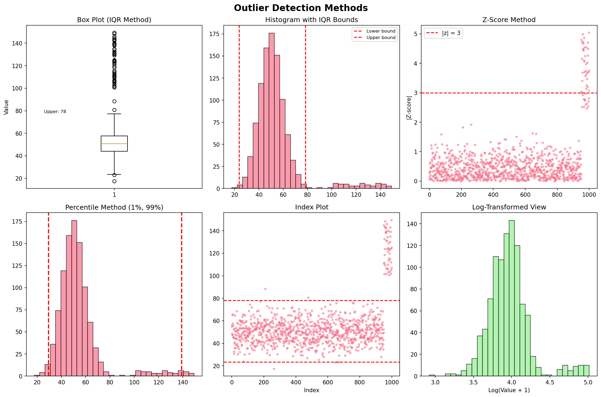

---

